# 文章_Web实例_报表开发01-基于HTML进行报表呈现_GF_2023-08-20

报表开发是一种在利用了软件的基础上, 针对不同类型的报表, 进行开放的工作。

而以报表的方式, 将相关的内容、数值呈现出来的话, 则会起到更好的概况作用。

再加上, 报表开发工作是依托于计算机来完成的, 因此在效率、完整性等方面, 表现的也很不错。

**报表开发的特点**:

1. 报表开发需要合理地进行分类, 至于分类的依据, 可以从样式这方面入手, 让不同样式的报表, 可以条理清晰地表现出工作内容。

2. 报表越多的情况下, 数据库的内容也会随之丰富起来, 因此报表开发应当具备一定的相关结构, 这样才能让数据库显得更连贯。

**报表开发的价值**:

1. 借助于报表开发, 可以对数据进行细致化处理, 而这个过程中运用到了计算机, 所以效率会比较高, 节省了人力上的成本。

2. 有数据报表的情况下, 结合相关的数据内容, 可以在更好的程度上进行决策分析, 从而让企业获得更具价值魅力的前景。

报表开发已经在很多做管理体系的公司当中, 得到了充分的使用, 发挥了自身的特点以及价值。

## 报表开发流程

1. 数据录入 (a. 数据填报, b. 数据清洗, c. 载入SQL数据库)

2. 数据权限 (根据组织架构设计不同账号类型能够涉及到的数据权限)

3. 数据呈现 (a. 按需提取SQL数据库的数据, b. 按需进行数据计算, c. 按需进行数据呈现)

4. 外观设计

**本例所处流程**: 属于 `3. 数据呈现` 中的 `c. 按需进行数据呈现` 部分。

(因为第 `3. 数据呈现` 中的 `c. 按需进行数据呈现` 部分非常便于快速理解 `报表开发` 所要达到的目标, 所以放在前面做实例演示)

## 实例数据

现有一份**XX集团2023年中秋国庆积分抵现明细表**, 已经过数据脱敏处理。

[CSV数据_XX集团2023年中秋国庆积分抵现明细表(已脱敏)_2024-03-31.zip](./CSV数据_XX集团2023年中秋国庆积分抵现明细表(已脱敏)_2024-03-31.zip)

数据包含**四川**, **西安**, **云南**三个省**2023年09月29日**至**2023年10月06日**共8日积分抵现的明细记录。

数据如下:

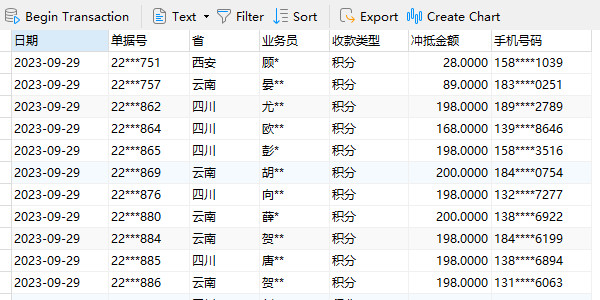

## 实例需求

* 能够直观的呈现各省由近到远(日期)的每日积分抵现合计金额。

* 能够直观的呈现各省由近到远(日期)的每日积分抵现平均金额。

* 能够直观的呈现各省由近到远(日期)的每日积分抵现增长幅度。

* 能够对每日低于三省平均积分抵现金额的省份进行预警。

## 需求梳理 - 设计需求 & 沟通需求

**需求(1)**: 能够直观的呈现各省由近到远(日期)的每日积分抵现合计金额。

使用 Microsoft Office Excel 2016 设计呈现效果。

使用数据透视表可以快速聚合数值, 排布行列:

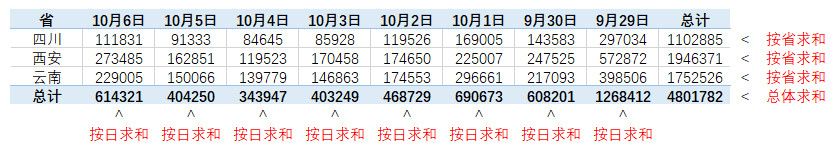

**需求(2)**: 能够直观的呈现各省由近到远(日期)的每日积分抵现平均金额。

使用 Microsoft Office Excel 2016 设计呈现效果。

使用数据透视表可以快速聚合数值, 排布行列:

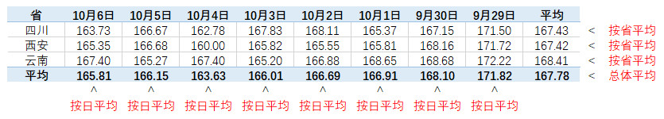

**需求(3)**: 能够直观的呈现各省由近到远(日期)的每日积分抵现增长幅度。

使用 Microsoft Office Excel 2016 设计呈现效果。

使用数据透视表可以快速聚合数值, 排布行列:

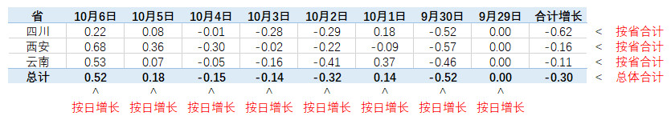

**需求(4)**: 能够对每日低于三省平均积分抵现金额的省份进行预警。

使用 Microsoft Office Excel 2016 设计呈现效果 (将需要预警的省份名称标红)。

使用数据透视表可以快速聚合数值, 排布行列:

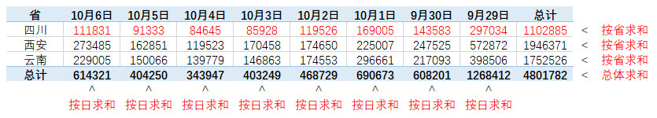

## 创建数据视图(View) - 为需求编写 SQL 语句

* 将报表所需的 "各省每日积分抵现合计金额", "各省每日积分抵现平均金额", "各省每日积分抵现增长幅度" 等尽量一次性计算为数据视图(View)。

效果如下:


$\downarrow$

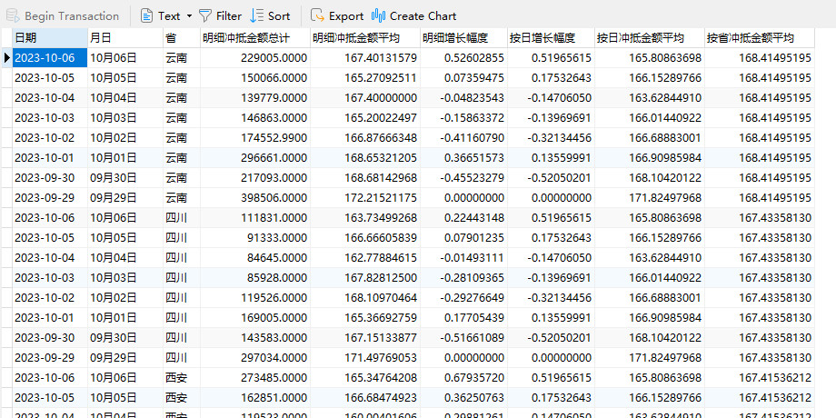

**附 MySQL 的 SQL 语句**:

```sql
CREATE OR REPLACE VIEW report_xxgroup_2023_zq_gq_points_deduction AS

WITH Drive_Aggregate_by_Date AS (
    SELECT
        日期,
        SUM(冲抵金额) AS 按日冲抵金额总计,
        AVG(冲抵金额) AS 按日冲抵金额平均
    FROM
        view_xxgroup_2023_zq_gq_points_deduction
    GROUP BY
        日期
)

, Drive_Aggregate_by_Province AS (
    SELECT
        省,
        SUM(冲抵金额) AS 按省冲抵金额总计,
        AVG(冲抵金额) AS 按省冲抵金额平均
    FROM
        view_xxgroup_2023_zq_gq_points_deduction
    GROUP BY
        省
)

, Drive_Aggregate_by_Date_and_Province AS (
    SELECT
        日期,
        省,
        SUM(冲抵金额) AS 明细冲抵金额总计,
        AVG(冲抵金额) AS 明细冲抵金额平均
    FROM
        view_xxgroup_2023_zq_gq_points_deduction
    GROUP BY
        日期,
        省
)

, Drive_OLAP_by_Date AS (
    SELECT
        日期,
        按日冲抵金额总计,
        按日冲抵金额平均,
        LEAD(按日冲抵金额总计, 1) OVER (ORDER BY 日期 DESC) AS 按日冲抵金额总计上日数据
    FROM
        Drive_Aggregate_by_Date
)

, Drive_OLAP_by_Date_and_Province AS (
    SELECT
        日期,
        省,
        明细冲抵金额总计,
        明细冲抵金额平均,
        LEAD(明细冲抵金额总计, 1) OVER (PARTITION BY 省 ORDER BY 日期 DESC) AS 明细冲抵金额总计上日数据
    FROM
        Drive_Aggregate_by_Date_and_Province
)

, Drive_Join_Table_Part_1 AS (
    SELECT
        T1.日期,
        T1.省,
        T1.明细冲抵金额总计,
        T1.明细冲抵金额平均,
        T2.按日冲抵金额平均,
        IF(T1.明细冲抵金额总计上日数据 IS NOT NULL, ((T1.明细冲抵金额总计 - T1.明细冲抵金额总计上日数据) / T1.明细冲抵金额总计上日数据), 0.0) AS 明细增长幅度,
        IF(T2.按日冲抵金额总计上日数据 IS NOT NULL, ((T2.按日冲抵金额总计 - T2.按日冲抵金额总计上日数据) / T2.按日冲抵金额总计上日数据), 0.0) AS 按日增长幅度
    FROM
        Drive_OLAP_by_Date_and_Province AS T1 LEFT JOIN Drive_OLAP_by_Date AS T2
    ON
        T1.日期 = T2.日期
)

SELECT
    T1.日期,
    DATE_FORMAT(T1.日期, "%m月%d日") AS 月日,
    T1.省,
    T1.明细冲抵金额总计,
    T1.明细冲抵金额平均,
    T1.明细增长幅度,
    T1.按日增长幅度,
    T1.按日冲抵金额平均,
    T2.按省冲抵金额平均
FROM
    Drive_Join_Table_Part_1 AS T1 LEFT JOIN Drive_Aggregate_by_Province AS T2
ON
    T1.省 = T2.省;

```

## 纯 HTML 实现 - 理解 Web 表格的构建形式

```txt
HTML 表格标签 <table>, <tr>, <th>, <td> 说明:

<table>: Table / 定义了 HTML 表格 (HTML 表格由 <table> 元素和 1 个或多个 <tr>, <th> 和 <td> 元素组成。

<tr>: Table Row / 表格中的一行。

<th>: Table Header Cell / 表格中的表头。

<td>: Table Data Cell / 表格中的一个单元格。
```

**以 "需求(1): 能够直观的呈现各省由近到远(日期)的每日积分抵现合计金额" 为例, 构建 Web 表格。**

效果如下:

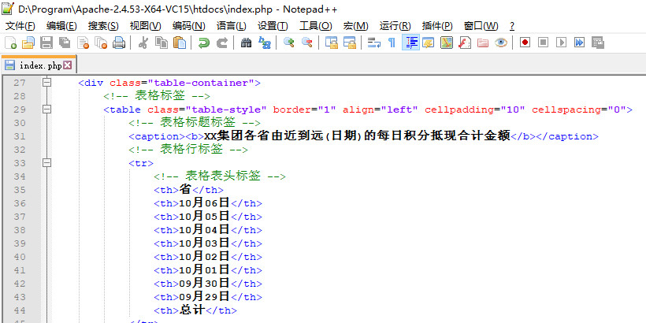

$\downarrow$


**附 HTML 代码**:

```html
<!DOCTYPE html>
<html lang="zh-CN">
<head>
    <meta charset="UTF-8">
</head>
<body style="background-color: #EFF3F5;">
    <div class="table-container">
        <!-- 表格标签 -->
        <table class="table-style" border="1" align="left" cellpadding="10" cellspacing="0">
            <!-- 表格标题标签 -->
            <caption><b>XX集团各省由近到远(日期)的每日积分抵现合计金额</b></caption>
            <!-- 表格行标签 -->
            <tr>
                <!-- 表格表头标签 -->
                <th>省</th>
                <th>10月06日</th>
                <th>10月05日</th>
                <th>10月04日</th>
                <th>10月03日</th>
                <th>10月02日</th>
                <th>10月01日</th>
                <th>09月30日</th>
                <th>09月29日</th>
                <th>总计</th>
            </tr>
            <tr>
                <!-- 表格单元格标签 -->
                <td align="center">四川</td>
                <td align="center">111831</td>
                <td align="center">91333</td>
                <td align="center">84645</td>
                <td align="center">85928</td>
                <td align="center">119526</td>
                <td align="center">169005</td>
                <td align="center">143583</td>
                <td align="center">297034</td>
                <td align="center">1102885</td>
            </tr>
            <tr>
                <td align="center">西安</td>
                <td align="center">273485</td>
                <td align="center">162851</td>
                <td align="center">119523</td>
                <td align="center">170458</td>
                <td align="center">174650</td>
                <td align="center">225007</td>
                <td align="center">247525</td>
                <td align="center">572872</td>
                <td align="center">1946371</td>
            </tr>
            <tr>
                <td align="center">云南</td>
                <td align="center">229005</td>
                <td align="center">150066</td>
                <td align="center">139779</td>
                <td align="center">146863</td>
                <td align="center">174553</td>
                <td align="center">296661</td>
                <td align="center">217093</td>
                <td align="center">398506</td>
                <td align="center">1752526</td>
            </tr>
            <tr>
                <td align="center"><b>总计</b></td>
                <td align="center"><b>614321</b></td>
                <td align="center"><b>404250</b></td>
                <td align="center"><b>343947</b></td>
                <td align="center"><b>403249</b></td>
                <td align="center"><b>468729</b></td>
                <td align="center"><b>690673</b></td>
                <td align="center"><b>608201</b></td>
                <td align="center"><b>1268412</b></td>
                <td align="center"><b>4801782</b></td>
            </tr>
        </table>
    </div>
</body>
</html>

```

## 动态生成 HTML 标记语言 - 实时调取数据库数据 (以 PHP 脚本为例)

这里为了方便演示, 使用了简单的 `PHP语言` 实现, 使用 `ASP语言`, `Java`, `JavaScript脚本语言`, Python 的 `Django Web框架` 等, 都可实现同样效果。

**以 "需求(2): 能够直观的呈现各省由近到远(日期)的每日积分抵现平均金额" 为例, 动态生成 HTML 标记语言, 构建 Web 表格。**

需要注意的是, 在实现 `需求(2)` 的时候, 各省份最右边行尾的 `各省总体平均值` 不能简单的将该行的数据平均, 因为 `先按日期分组平均再加总平均` 与 `直接按省份总体平均` 的结果会有差异, 因为每组数据的数量不一样, 需要先在数据库计算好。

效果如下:

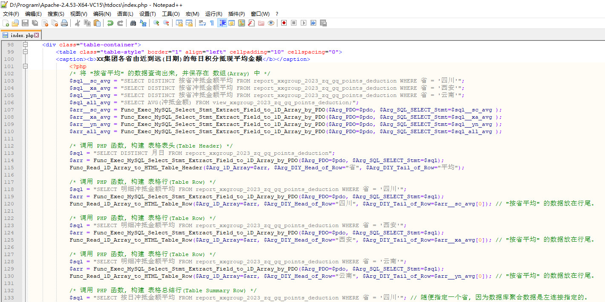

$\downarrow$

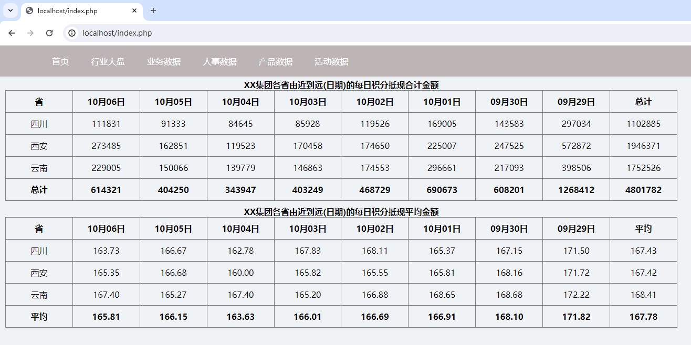

**附 需求(2) 在 index.php 中 PHP 的函数调用代码**:

```php
<div class="table-container">
    <table class="table-style" border="1" align="left" cellpadding="10" cellspacing="0">
    <caption><b>XX集团各省由近到远(日期)的每日积分抵现平均金额</b></caption>
        <?php
        /* 通过 PDO 初始化 MySQL 连接 */
        $pdo = Func_Init_MySQL_Connect_by_PDO($Arg_Host="127.0.0.1", $Arg_UserName="goufeng");
        
        /* 将 "按省平均" 的数据查询出来, 并保存在 数组(Array) 中 */
        $sql__sc_avg = "SELECT DISTINCT 按省冲抵金额平均 FROM report_xxgroup_2023_zq_gq_points_deduction WHERE 省 = '四川'";
        $sql__xa_avg = "SELECT DISTINCT 按省冲抵金额平均 FROM report_xxgroup_2023_zq_gq_points_deduction WHERE 省 = '西安'";
        $sql__yn_avg = "SELECT DISTINCT 按省冲抵金额平均 FROM report_xxgroup_2023_zq_gq_points_deduction WHERE 省 = '云南'";
        $sql_all_avg = "SELECT AVG(冲抵金额) FROM view_xxgroup_2023_zq_gq_points_deduction;";
        $arr__sc_avg = Func_Exec_MySQL_Select_Stmt_Extract_Field_to_1D_Array_by_PDO($Arg_PDO=$pdo, $Arg_SQL_SELECT_Stmt=$sql__sc_avg );
        $arr__xa_avg = Func_Exec_MySQL_Select_Stmt_Extract_Field_to_1D_Array_by_PDO($Arg_PDO=$pdo, $Arg_SQL_SELECT_Stmt=$sql__xa_avg );
        $arr__yn_avg = Func_Exec_MySQL_Select_Stmt_Extract_Field_to_1D_Array_by_PDO($Arg_PDO=$pdo, $Arg_SQL_SELECT_Stmt=$sql__yn_avg );
        $arr_all_avg = Func_Exec_MySQL_Select_Stmt_Extract_Field_to_1D_Array_by_PDO($Arg_PDO=$pdo, $Arg_SQL_SELECT_Stmt=$sql_all_avg );
        
        /* 调用 PHP 函数, 构建 表格表头(Table Header) */
        $sql = "SELECT DISTINCT 月日 FROM report_xxgroup_2023_zq_gq_points_deduction";
        $arr = Func_Exec_MySQL_Select_Stmt_Extract_Field_to_1D_Array_by_PDO($Arg_PDO=$pdo, $Arg_SQL_SELECT_Stmt=$sql);
        Func_Read_1D_Array_to_HTML_Table_Header($Arg_1D_Array=$arr, $Arg_DIY_Head_of_Row="省", $Arg_DIY_Tail_of_Row="平均");
        
        /* 调用 PHP 函数, 构建 表格行(Table Row) */
        $sql = "SELECT 明细冲抵金额平均 FROM report_xxgroup_2023_zq_gq_points_deduction WHERE 省 = '四川'";
        $arr = Func_Exec_MySQL_Select_Stmt_Extract_Field_to_1D_Array_by_PDO($Arg_PDO=$pdo, $Arg_SQL_SELECT_Stmt=$sql);
        Func_Read_1D_Array_to_HTML_Table_Row($Arg_1D_Array=$arr, $Arg_DIY_Head_of_Row="四川", $Arg_DIY_Tail_of_Row=$arr__sc_avg[0]); // "按省平均" 的数据放在行尾。
        
        /* 调用 PHP 函数, 构建 表格行(Table Row) */
        $sql = "SELECT 明细冲抵金额平均 FROM report_xxgroup_2023_zq_gq_points_deduction WHERE 省 = '西安'";
        $arr = Func_Exec_MySQL_Select_Stmt_Extract_Field_to_1D_Array_by_PDO($Arg_PDO=$pdo, $Arg_SQL_SELECT_Stmt=$sql);
        Func_Read_1D_Array_to_HTML_Table_Row($Arg_1D_Array=$arr, $Arg_DIY_Head_of_Row="西安", $Arg_DIY_Tail_of_Row=$arr__xa_avg[0]); // "按省平均" 的数据放在行尾。
        
        /* 调用 PHP 函数, 构建 表格行(Table Row) */
        $sql = "SELECT 明细冲抵金额平均 FROM report_xxgroup_2023_zq_gq_points_deduction WHERE 省 = '云南'";
        $arr = Func_Exec_MySQL_Select_Stmt_Extract_Field_to_1D_Array_by_PDO($Arg_PDO=$pdo, $Arg_SQL_SELECT_Stmt=$sql);
        Func_Read_1D_Array_to_HTML_Table_Row($Arg_1D_Array=$arr, $Arg_DIY_Head_of_Row="云南", $Arg_DIY_Tail_of_Row=$arr__yn_avg[0]); // "按省平均" 的数据放在行尾。
        
        /* 调用 PHP 函数, 构建 表格总结行(Table Summary Row) */
        $sql = "SELECT 按日冲抵金额平均 FROM report_xxgroup_2023_zq_gq_points_deduction WHERE 省 = '四川'"; // 随便指定一个省, 因为数据库聚合数据是左连接指定的。
        $arr = Func_Exec_MySQL_Select_Stmt_Extract_Field_to_1D_Array_by_PDO($Arg_PDO=$pdo, $Arg_SQL_SELECT_Stmt=$sql);
        Func_Read_1D_Array_to_HTML_Table_Header($Arg_1D_Array=$arr, $Arg_DIY_Head_of_Row="平均", $Arg_DIY_Tail_of_Row=$arr_all_avg[0]); // "按省平均" 的数据放在行尾。
        ?>
    </table>
</div>
```

**以 "需求(3): 能够直观的呈现各省由近到远(日期)的每日积分抵现增长幅度" 为例, 动态生成 HTML 标记语言, 构建 Web 表格。**

效果如下:

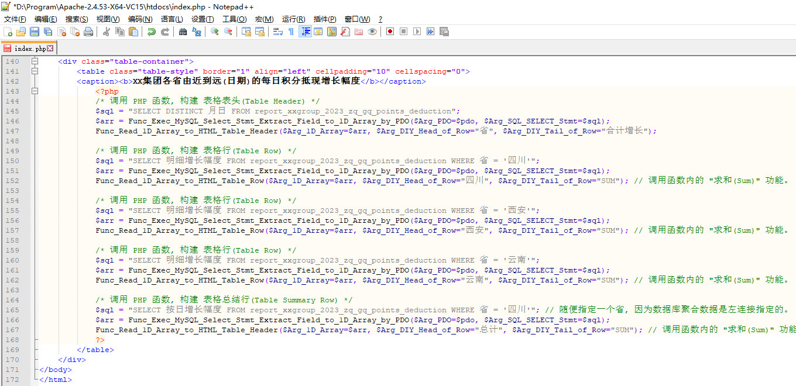

$\downarrow$

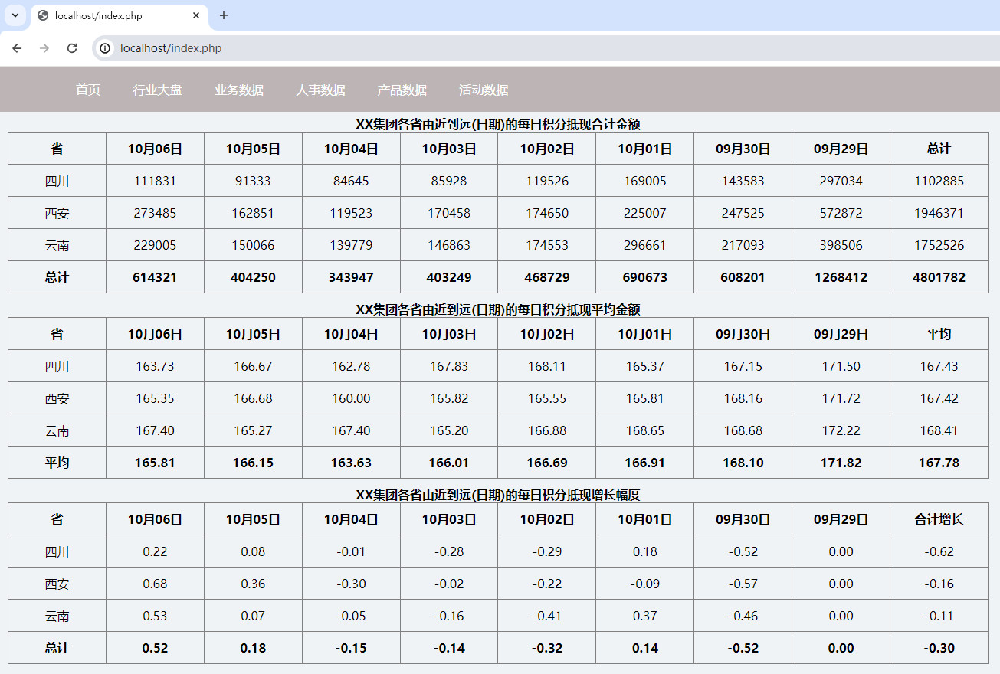

**附 需求(3) 在 index.php 中 PHP 的函数调用代码**:

```php
<div class="table-container">
    <table class="table-style" border="1" align="left" cellpadding="10" cellspacing="0">
    <caption><b>XX集团各省由近到远(日期)的每日积分抵现增长幅度</b></caption>
        <?php
        /* 调用 PHP 函数, 构建 表格表头(Table Header) */
        $sql = "SELECT DISTINCT 月日 FROM report_xxgroup_2023_zq_gq_points_deduction";
        $arr = Func_Exec_MySQL_Select_Stmt_Extract_Field_to_1D_Array_by_PDO($Arg_PDO=$pdo, $Arg_SQL_SELECT_Stmt=$sql);
        Func_Read_1D_Array_to_HTML_Table_Header($Arg_1D_Array=$arr, $Arg_DIY_Head_of_Row="省", $Arg_DIY_Tail_of_Row="合计增长");
        
        /* 调用 PHP 函数, 构建 表格行(Table Row) */
        $sql = "SELECT 明细增长幅度 FROM report_xxgroup_2023_zq_gq_points_deduction WHERE 省 = '四川'";
        $arr = Func_Exec_MySQL_Select_Stmt_Extract_Field_to_1D_Array_by_PDO($Arg_PDO=$pdo, $Arg_SQL_SELECT_Stmt=$sql);
        Func_Read_1D_Array_to_HTML_Table_Row($Arg_1D_Array=$arr, $Arg_DIY_Head_of_Row="四川", $Arg_DIY_Tail_of_Row="SUM"); // 调用函数内的 "求和(Sum)" 功能。
        
        /* 调用 PHP 函数, 构建 表格行(Table Row) */
        $sql = "SELECT 明细增长幅度 FROM report_xxgroup_2023_zq_gq_points_deduction WHERE 省 = '西安'";
        $arr = Func_Exec_MySQL_Select_Stmt_Extract_Field_to_1D_Array_by_PDO($Arg_PDO=$pdo, $Arg_SQL_SELECT_Stmt=$sql);
        Func_Read_1D_Array_to_HTML_Table_Row($Arg_1D_Array=$arr, $Arg_DIY_Head_of_Row="西安", $Arg_DIY_Tail_of_Row="SUM"); // 调用函数内的 "求和(Sum)" 功能。
        
        /* 调用 PHP 函数, 构建 表格行(Table Row) */
        $sql = "SELECT 明细增长幅度 FROM report_xxgroup_2023_zq_gq_points_deduction WHERE 省 = '云南'";
        $arr = Func_Exec_MySQL_Select_Stmt_Extract_Field_to_1D_Array_by_PDO($Arg_PDO=$pdo, $Arg_SQL_SELECT_Stmt=$sql);
        Func_Read_1D_Array_to_HTML_Table_Row($Arg_1D_Array=$arr, $Arg_DIY_Head_of_Row="云南", $Arg_DIY_Tail_of_Row="SUM"); // 调用函数内的 "求和(Sum)" 功能。
        
        /* 调用 PHP 函数, 构建 表格总结行(Table Summary Row) */
        $sql = "SELECT 按日增长幅度 FROM report_xxgroup_2023_zq_gq_points_deduction WHERE 省 = '四川'"; // 随便指定一个省, 因为数据库聚合数据是左连接指定的。
        $arr = Func_Exec_MySQL_Select_Stmt_Extract_Field_to_1D_Array_by_PDO($Arg_PDO=$pdo, $Arg_SQL_SELECT_Stmt=$sql);
        Func_Read_1D_Array_to_HTML_Table_Header($Arg_1D_Array=$arr, $Arg_DIY_Head_of_Row="总计", $Arg_DIY_Tail_of_Row="SUM"); // 调用函数内的 "求和(Sum)" 功能。
        ?>
    </table>
</div>
```

**附 PHP 连接 MySQL 函数定义代码 (PDO 函数)**:

```php
/*
 * Create By GF 2024-03-29
 */

/* 初始化 MySQL 连接函数 - 通过 PDO 初始化 MySQL 连接 */
function Func_Init_MySQL_Connect_by_PDO($Arg_Host="127.0.0.1", $Arg_UserName="anonymous", $Arg_Password="12345678", $Arg_Database="gf_demo") {

   /*
    * PDO 连接关闭方法 1. 设置 PDO 连接的 PDO::ATTR_PERSISTENT 属性为 false。
    *                     在 PDO 的构造函数中, 可以设置第四个参数为 false 来关闭连接。
    *                     例如, $pdo = new PDO('mysql:host=localhost;dbname=test', 'username', 'password', array(PDO::ATTR_PERSISTENT => false));。
    *
    * PDO 连接关闭方法 2. 使用 null 来关闭 PDO 连接。
    *                     可以将 PDO 对象设置为 null 来关闭连接。
    *                     例如, $pdo = null;, 这会释放连接资源, 并确保数据库连接在不需要时不会一直占用系统资源。
    * 
    * 当脚本执行完成或调用了 exit() 函数时, PDO 会自动关闭数据库连接。在大多数情况下, 不需要显式地关闭连接。
    */
    
    $Inr_Host = $Arg_Host;
    $Inr_UserName = $Arg_UserName;
    $Inr_Password = $Arg_Password;
    $Inr_Database = $Arg_Database;
    
    try {

        /* -------------------------------------- */
        /* 创建 mysql_connect 数据库连接 */
        $dsn = "mysql:host=".$Inr_Host.";port=3306;charset=utf8;dbname=".$Inr_Database;
		/* ...................................... */
        $pdo = new PDO($dsn, $Inr_UserName, $Inr_Password);
        /* ...................................... */
        return $pdo;
    } catch (PDOException $e) {

        /* -------------------------------------- */
        /* MySQL 连接失败时显示错误信息 */
        die ("Database Connection Error: ".$e->getMessage()."<br>");
    }
}

/* 执行 MySQL SELECT 语句函数 - 通过 PDO 提取单个字段到 1 维 数组(Array) */
function Func_Exec_MySQL_SELECT_Stmt_Extract_Field_to_1D_Array_by_PDO($Arg_PDO, $Arg_SQL_SELECT_Stmt) {

    $Inr_PDO = $Arg_PDO;
    /* .......................................... */
    /* 从 参数(Arguments) 传递 SQL 的 SELECT 语句 */
	$Inr_SQL_Statements = $Arg_SQL_SELECT_Stmt;
    
    /* ------------------------------------------ */
    /* 验证 SQL 的 SELECT 语句是否只包含 1 个字段 */
    preg_match("/SELECT .* FROM/i", $Inr_SQL_Statements, $matches);
    /* .......................................... */
    $Part_SELECT_of_SQL_Stmt = $matches[0];
    /* .......................................... */
    $Part_SELECT_of_SQL_Stmt = str_ireplace(array("SELECT ", "SELECT DISTINCT ", " FROM"), "", $Part_SELECT_of_SQL_Stmt);
    /* .......................................... */
    $Part_SELECT_of_SQL_Stmt = preg_split("/,/i", $Part_SELECT_of_SQL_Stmt);
    /* .......................................... */
    if (count($Part_SELECT_of_SQL_Stmt) > 1) {
        /* 如果 SQL 的 SELECT 语句包含多个字段, 则终止函数运行 */
        echo "[Caution] Function ( Func_Exec_MySQL_SELECT_Stmt_Extract_Field_to_1D_Array_by_PDO ) Running Error: SQL SELECT Statement Contains Multiple Fields.";
        exit();
    }

    /* ------------------------------------------ */
    try {

        /* -------------------------------------- */
        /* 查询(SELECT) 语句执行成功后提取数据到数组(Array) */
        $Rtn_Array = array();

        /* -------------------------------------- */
        /* 执行查询语句 */
        $Result = $Inr_PDO->query($Inr_SQL_Statements);
        /* ...................................... */
        /* 返回值是一个嵌套数组, 每一行为一个数组 (键为行号, 值为行的数组), 每一行里面又包含每个 "字段=>值" 的数组 (键为字段，值为字段的值) */
        $Data = $Result->fetchAll(PDO::FETCH_ASSOC);
        /* ...................................... */
        foreach ($Data as $Num => $Line) {
            //echo "This is The ".$Num." Line.";
            foreach ($Line as $Field => $Value) {
                /*
                 * PHP 数组(Array) 添加元素示例:
                 * $array = array(1, 2, 3);                 // -> 声明 数组(Array) 并赋值 1, 2, 3。
                 * array_push($array, 4);                   // -> 向 数组(Array) 添加单个元素。
                 * array_push($array, 5, 6);                // -> 向 数组(Array) 添加多个元素。
                 * $array[] = 4;                            // -> 将 4 添加到 数组(Array) 末尾。
                 * $array[0] = 0;                           // -> 将 0 添加到 数组(Array) 指定下标位置。
                 * $newArray = array(4);                    // -> 声明一个新的 数组(Array) 并赋值 4。
                 * $array = array_merge($array, $newArray); // -> 使用 array_merge() 函数将包含新元素的 数组(Array) 合并到原 数组(Array) 末尾。
                 * array_splice($array, 1, 0, $newArray);   // -> 使用 array_splice() 函数将包含新元素的 数组(Array) 插入到指定下标位置。
                 */
                array_push($Rtn_Array, $Value);
            }
        }
        /* ...................................... */
        return $Rtn_Array;
    } catch (PDOException $e) {

        /* MySQL 查询失败时显示错误信息 */
        die ("[Caution] Database Query Error: ".$e->getMessage()."<br>");
    }
}

```

**附 PHP 输出 表格行(Table Row) 函数定义代码**:

```php
/*
 * Create By GF 2024-03-29
 */

/* 数组(Array) 操作函数 - 对 1D Array 中的数字求和 */
function Func_Numeric_in_1D_Array_Sum($Arg_1D_Array) {

    $Inr_1D_Array = $Arg_1D_Array;
    
    /* ------------------------------------------ */
    /* 获取 1 维 数组(Array) 的长度 */
    $Inr_1D_Array_Length = count($Inr_1D_Array);
    
    /* ------------------------------------------ */
    if ($Inr_1D_Array_Length == 0) {
        
        return NULL;
    } else {

        $Calc_Sum = 0;
        
        /* -------------------------------------- */
        for($i=0; $i < $Inr_1D_Array_Length; $i++)
            if (is_numeric($Inr_1D_Array[$i]) == true)
                $Calc_Sum += $Inr_1D_Array[$i];
        
        /* -------------------------------------- */
        return $Calc_Sum;
    }
}

/* 数组(Array) 操作函数 - 对 1D Array 中的数字求平均 */
function Func_Numeric_in_1D_Array_Avg($Arg_1D_Array) {
    
    $Inr_1D_Array = $Arg_1D_Array;
    
    /* ------------------------------------------ */
    /* 获取 1 维 数组(Array) 的长度 */
    $Inr_1D_Array_Length = count($Inr_1D_Array);
    
    /* ------------------------------------------ */
    if ($Inr_1D_Array_Length == 0) {
        
        return NULL;
    } else {
        
        $Calc_Sum = 0;
        $Calc_Count = 0;
        
        /* -------------------------------------- */
        for($i=0; $i < $Inr_1D_Array_Length; $i++) {
            if (is_numeric($Inr_1D_Array[$i]) == true) {
                $Calc_Sum += $Inr_1D_Array[$i];
                $Calc_Count += 1;
            }
        }

        /* -------------------------------------- */
        /* 计算平均值: 平均值 = 总和 / 数量 */
        $Calc_Avg = $Calc_Sum / $Calc_Count;
        
        /* -------------------------------------- */
        return $Calc_Avg;
    }
}

/* 生成 HTML 函数 - 读取 1D Array 到 HTML 表格表头(Table Header) */
function Func_Read_1D_Array_to_HTML_Table_Header($Arg_1D_Array, $Arg_DIY_Head_of_Row=NULL, $Arg_DIY_Tail_of_Row=NULL, $Arg_Decimal_Places=2) {

    $Inr_1D_Array = $Arg_1D_Array;
    
    /* ------------------------------------------ */
    /* 自定义(DIY) 行头(Head of Row) */
    if ($Arg_DIY_Head_of_Row != NULL) $Inr_1D_Array = array_merge(array($Arg_DIY_Head_of_Row), $Inr_1D_Array);
    
    /* ------------------------------------------ */
    /* 自定义(DIY) 行尾(Tail of Row) */
    if (strtoupper($Arg_DIY_Tail_of_Row) == "SUM") {
        array_push($Inr_1D_Array, Func_Numeric_in_1D_Array_Sum($Inr_1D_Array));
    } else if (strtoupper($Arg_DIY_Tail_of_Row) == "AVG") {
        array_push($Inr_1D_Array, Func_Numeric_in_1D_Array_Avg($Inr_1D_Array));
    } else if ($Arg_DIY_Tail_of_Row != NULL) {
        array_push($Inr_1D_Array, $Arg_DIY_Tail_of_Row);
    }

    /* ------------------------------------------ */
    /* 获取 1 维 数组(Array) 的长度 */
    $Inr_1D_Array_Length = count($Inr_1D_Array);
    
    /* ------------------------------------------ */
    /* 对 数组(Array) 中数字的小数位数进行重置 */
    if ($Arg_Decimal_Places != NULL && is_numeric($Arg_Decimal_Places) == true)
        for($i=0; $i < $Inr_1D_Array_Length; $i++) if (is_numeric($Inr_1D_Array[$i]) == true)
            $Inr_1D_Array[$i] = sprintf("%.".$Arg_Decimal_Places."f", $Inr_1D_Array[$i]);

    /* ------------------------------------------ */
    /* 判断 1 维 数组(Array) 的长度 (是否有数据) */
    if ($Inr_1D_Array_Length < 1) {
        
        /* -------------------------------------- */
        /* 如果 1 维 数组(Array) 的长度为 0 (没有数据) */
        echo "<div class=\"table-container\">";
        echo "    <table class=\"table-style\" border=\"1\" align=\"left\" cellpadding=\"10\" cellspacing=\"0\">";
        echo "        <tr>";
        echo "            <th>[Caution] Function ( Func_Read_1D_Array_to_HTML_Table_Row ) Value of 1D Array Error: No Data Available.</th>";
        echo "        </tr>";
        echo "    </table>";
        echo "</div>";
    } else {
        
        /* -------------------------------------- */
        /* 如果 1 维 数组(Array) 的长度大于 0 (有数据) */
        echo "<tr>";
        for($i=0; $i < $Inr_1D_Array_Length; $i++) {
            
            echo "<th>".$Inr_1D_Array[$i]."</th>";
        }
        echo "</tr>";
    }
}

/* 生成 HTML 函数 - 读取 1D Array 到 HTML 表格行(Table Row) */
function Func_Read_1D_Array_to_HTML_Table_Row($Arg_1D_Array, $Arg_DIY_Head_of_Row=NULL, $Arg_DIY_Tail_of_Row=NULL, $Arg_Decimal_Places=2) {
    
    $Inr_1D_Array = $Arg_1D_Array;
    
    /* ------------------------------------------ */
    /* 自定义(DIY) 行头(Head of Row) */
    if ($Arg_DIY_Head_of_Row != NULL) $Inr_1D_Array = array_merge(array($Arg_DIY_Head_of_Row), $Inr_1D_Array);
    
    /* ------------------------------------------ */
    /* 自定义(DIY) 行尾(Tail of Row) */
    if (strtoupper($Arg_DIY_Tail_of_Row) == "SUM") {
        array_push($Inr_1D_Array, Func_Numeric_in_1D_Array_Sum($Inr_1D_Array));
    } else if (strtoupper($Arg_DIY_Tail_of_Row) == "AVG") {
        array_push($Inr_1D_Array, Func_Numeric_in_1D_Array_Avg($Inr_1D_Array));
    } else if ($Arg_DIY_Tail_of_Row != NULL) {
        array_push($Inr_1D_Array, $Arg_DIY_Tail_of_Row);
    }
    
    /* ------------------------------------------ */
    /* 获取 1 维 数组(Array) 的长度 */
    $Inr_1D_Array_Length = count($Inr_1D_Array);
    
    /* ------------------------------------------ */
    /* 对 数组(Array) 中数字的小数位数进行重置 */
    if ($Arg_Decimal_Places != NULL && is_numeric($Arg_Decimal_Places) == true)
        for($i=0; $i < $Inr_1D_Array_Length; $i++) if (is_numeric($Inr_1D_Array[$i]) == true)
            $Inr_1D_Array[$i] = sprintf("%.".$Arg_Decimal_Places."f", $Inr_1D_Array[$i]);
    
    /* ------------------------------------------ */
    /* 判断 1 维 数组(Array) 的长度 (是否有数据) */
    if ($Inr_1D_Array_Length < 1) {
        
        /* -------------------------------------- */
        /* 如果 1 维 数组(Array) 的长度为 0 (没有数据) */
        echo "<div class=\"table-container\">";
        echo "    <table class=\"table-style\" border=\"1\" align=\"left\" cellpadding=\"10\" cellspacing=\"0\">";
        echo "        <tr>";
        echo "            <td>[Caution] Function ( Func_Read_1D_Array_to_HTML_Table_Row ) Value of 1D Array Error: No Data Available.</td>";
        echo "        </tr>";
        echo "    </table>";
        echo "</div>";
    } else {
        
        /* -------------------------------------- */
        /* 如果 1 维 数组(Array) 的长度大于 0 (有数据) */
        echo "<tr>";
        for($i=0; $i < $Inr_1D_Array_Length; $i++) {
                
            echo "<td align=\"center\">".$Inr_1D_Array[$i]."</td>";
        }
        echo "</tr>";
    }
}

```

## 使用 CSS 对 HTML 进行样式设计 - 调整字体颜色

层叠样式表 (英文全称: Cascading Style Sheets) 是一种用来表现 HTML (标准通用标记语言的一个应用) 或 XML(标准通用标记语言的一个子集) 等文件样式的计算机语言。

CSS 不仅可以静态地修饰网页, 还可以配合各种脚本语言动态地对网页各元素进行格式化。

**以 "需求(4): 能够对每日低于三省平均积分抵现金额的省份进行预警" 为例, 利用 CSS 指定 HTML 标记样式, 更改字体颜色。**

本例为了方便演示, 并且可以很直观看出, `四川` 这个省份每个日期的数据都是明显低于三个省份的平均值的, 我们直接让 `四川` 这个省份的数据以 `红色字体` 显示, 以达到预警的效果。

**步骤(1)**:

修改包含有 `四川` 数据的 表格行(Table Row) 的单元格中给 HTML 标签加上 类(Class) 属性。

(即在包含有 `四川` 数据的 `<tr>` 标签中的所有 `<td>` 标签加上 `class` 属性)

在 `<td>` 标签中添加 `class="alarm"` 属性:

```html
<!-- 表格行标签 -->
<tr>
    <!-- 表格单元格标签 -->
    <td class="alarm" align="center">四川</td>
    <td class="alarm" align="center">111831</td>
    <td class="alarm" align="center">91333</td>
    <td class="alarm" align="center">84645</td>
    <td class="alarm" align="center">85928</td>
    <td class="alarm" align="center">119526</td>
    <td class="alarm" align="center">169005</td>
    <td class="alarm" align="center">143583</td>
    <td class="alarm" align="center">297034</td>
    <td class="alarm" align="center">1102885</td>
</tr>
```

**步骤(2)**:

在 HTML 文档的 `<head>` 部分, 使用 `<style>` 标签来包含 CSS 代码 (内部样式表)。

通过 `.alarm` 来选择 `alarm 类`, 并在其后的 {} 内指定 `color: #FF0000;` 或者 `color: red;` 来将字体改成红色 (清除浏览器缓存后可见效果)。

```html
<!DOCTYPE html>
<html lang="zh-CN">
<head>
    <meta charset="UTF-8">
    <style>
        .alarm {
            /* 指定 alarm 类的字体颜色为红色 */
            color: #FF0000;
        }
    </style>
</head>
<body>
<!-- 表格标签 -->
        <table class="table-style" border="1" align="left" cellpadding="10" cellspacing="0">
            <!-- 表格标题标签 -->
            <caption><b>XX集团各省由近到远(日期)的每日积分抵现合计金额</b></caption>
            <!-- 表格行标签 -->
            <tr>
                <!-- 表格单元格标签 -->
                <td class="alarm" align="center">四川</td>
                <td class="alarm" align="center">111831</td>
                <td class="alarm" align="center">91333</td>
                <td class="alarm" align="center">84645</td>
                <td class="alarm" align="center">85928</td>
                <td class="alarm" align="center">119526</td>
                <td class="alarm" align="center">169005</td>
                <td class="alarm" align="center">143583</td>
                <td class="alarm" align="center">297034</td>
                <td class="alarm" align="center">1102885</td>
            </tr>
        </table>
</body>
</html>
```

效果如下:

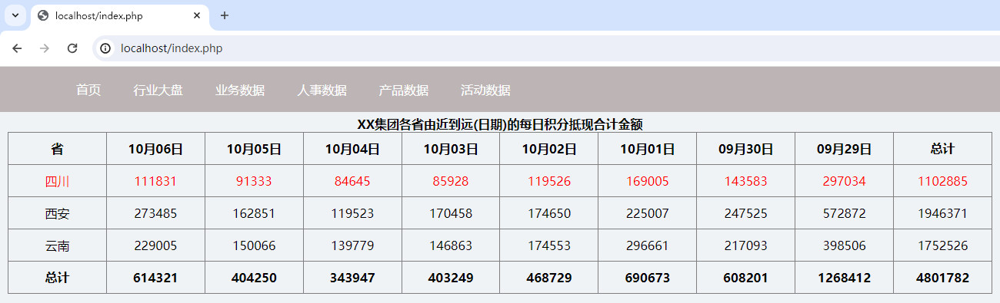

## 总结

以上就是关于 Web实例 报表开发01-基于HTML进行报表呈现 的全部内容。

更多内容可以访问我的代码仓库:

https://gitee.com/goufeng928/public

https://github.com/goufeng928/public
