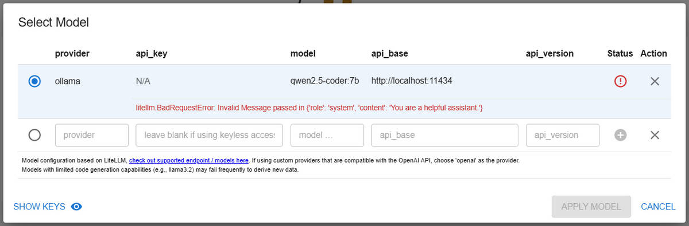
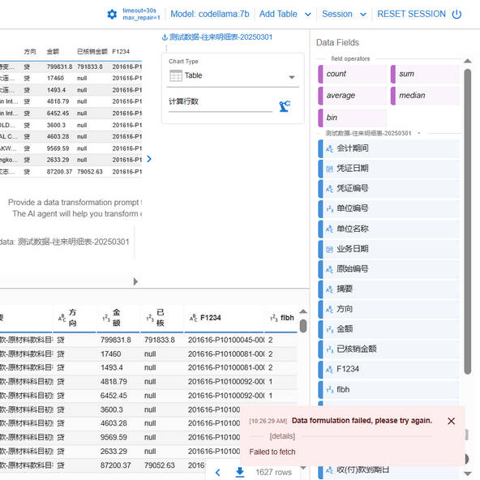

# 文章_数据分析_Data-Formulator-0.1.7调用Ollama-0.5问题记录_GF_2025-04-01

## 1. 添加 Ollama 模型 出现 litellm.BadRequestError: Invalid Message passed in {'role': 'system', 'content': 'You are a helpful assistant.'}



使用 litellm 单独测试调用模型 API (POST), 传入消息:

```txt
>>> import os
>>> from litellm import completion
>>>
>>> os.environ["OLLAMA_HOST"] = "http://localhost:11434"
>>>
>>> Messages = [{"role": "user", "content": "为什么天空是蓝色的?"}]
>>>
>>> response = completion(model="ollama/qwen2.5-coder",  messages=Messages, stream=False)
>>> response
ModelResponse(id='chatcmpl-06a0347e-992b-4c33-8642-84a682ec126d', created=1743471942, model='ollama/qwen2.5-coder', object='chat.completion', system_fingerprint=None, choices=[Choices(finish_reason='stop', index=0, message=Message(content='天空之所以呈现蓝色, 主要是由于大气中的分子和微小颗粒对太阳光的散射作用。这个现象被称为瑞利散射 (Rayleigh scattering)。\n\n1. **波长差异**：太阳光由多种不同波长的光线组成, 其中蓝色光的波长较短, 大约为400-500纳米; 而红色光的波长较长, 大约为620-750纳米。瑞利散射的程度与光源光的波长的四次方成反比。\n\n2. **散射作用**：由于蓝光的波长较短, 因此在大气中的分子和微小颗粒上更容易发生散射。这意味着当太阳光线穿过地球的大气层时, 大部分蓝光会被这些微小物体散射向各个方向。\n\n3. **视觉效果**：虽然天空中所有颜色的光都被散射了, 但由于蓝光被散射得最为强烈, 我们看到的是一个蓝色的天空。在日落或日出时分, 由于太阳位于地平线附近, 光线需要穿过更多的大气层, 此时蓝光会被进一步散射, 而红、橙等长波长的光则相对较少被散射, 因此这些颜色的光更集中在天边, 形成了绚丽的日落和日出景象。\n\n综上所述, 天空之所以呈现蓝色, 主要是由于太阳光中蓝光的波长较短, 容易在大气中的分子和微小颗粒上发生瑞利散射。', role='assistant', tool_calls=None, function_call=None, provider_specific_fields=None))], usage=Usage(completion_tokens=313, prompt_tokens=38, total_tokens=351, completion_tokens_details=None, prompt_tokens_details=None))
>>>
>>> Messages = [{"role": "system", "content": "为什么天空是蓝色的?"}]
>>>
>>> response = completion(model="ollama/qwen2.5-coder",  messages=Messages, stream=False)
Traceback (most recent call last):
  File "<stdin>", line 1, in <module>
  File "/usr/local/lib/python3.12/site-packages/litellm/utils.py", line 1235, in wrapper
    raise e
  File "/usr/local/lib/python3.12/site-packages/litellm/utils.py", line 1113, in wrapper
    result = original_function(*args, **kwargs)
             ^^^^^^^^^^^^^^^^^^^^^^^^^^^^^^^^^^
  File "/usr/local/lib/python3.12/site-packages/litellm/main.py", line 3101, in completion
    raise exception_type(
  File "/usr/local/lib/python3.12/site-packages/litellm/main.py", line 2823, in completion
    response = base_llm_http_handler.completion(
               ^^^^^^^^^^^^^^^^^^^^^^^^^^^^^^^^^
  File "/usr/local/lib/python3.12/site-packages/litellm/llms/custom_httpx/llm_http_handler.py", line 247, in completion
    data = provider_config.transform_request(
           ^^^^^^^^^^^^^^^^^^^^^^^^^^^^^^^^^^
  File "/usr/local/lib/python3.12/site-packages/litellm/llms/ollama/completion/transformation.py", line 315, in transform_request
    modified_prompt = ollama_pt(model=model, messages=messages)
                      ^^^^^^^^^^^^^^^^^^^^^^^^^^^^^^^^^^^^^^^^^
  File "/usr/local/lib/python3.12/site-packages/litellm/litellm_core_utils/prompt_templates/factory.py", line 265, in ollama_pt
    raise litellm.BadRequestError(
litellm.exceptions.BadRequestError: litellm.BadRequestError: Invalid Message passed in {'role': 'system', 'content': '为什么天空是蓝色的？'}
```
根据错误信息和代码分析, 问题出在 system 角色不被 Ollama 模型支持。

Ollama 的 qwen2.5-coder (及大多数本地模型) 的 API 设计基于纯文本输入,
不支持 OpenAI 风格的 system/user/assistant 角色分块。
当使用 system 角色时, litellm 尝试将消息转换为 Ollama 不兼容的格式, 导致问题。

Ollama 的 /api/generate 接口直接接受 prompt 字符串 (而非多角色的消息列表),
因此需要将 system 指令合并到用户输入中 (将 system 内容合并到 user 消息中)。

定位到 /usr/local/lib/python3.12/site-packages 目录下 (所在目录可能因实际情况不同)
修改以下文件:

**data_formulator/app.py**

将其中的 `"role":"system"` 改为 `"role":"user"` 即可

## 2. 点击 Formulat 出现 Data formulation failed, please try again. 返回 None



查看后台 Flask 输出:

```txt
[root@localhost ~]# data_formulator -p 5000
/usr/local/lib/python3.12/site-packages/data_formulator
2025-04-01 10:28:39,241 - data_formulator.app - INFO - Application level log
2025-04-01 10:28:39,241 - data_formulator.app - INFO - Application level log
2025-04-01 10:28:39,241 - data_formulator.app - INFO - Flask specific log
2025-04-01 10:28:39,241 - data_formulator.app - INFO - Flask specific log
 * Serving Flask app 'data_formulator.app'
 * Debug mode: off
2025-04-01 10:28:39,250 - werkzeug - INFO - WARNING: This is a development server. Do not use it in a production deployment. Use a production WSGI server instead.
 * Running on all addresses (0.0.0.0)
 * Running on http://127.0.0.1:5000
 * Running on http://10.47.167.233:5000
2025-04-01 10:28:39,250 - werkzeug - INFO - Press CTRL+C to quit
2025-04-01 10:29:18,628 - data_formulator.app - INFO - # request data:
2025-04-01 10:29:18,628 - data_formulator.app - INFO - # request data:
2025-04-01 10:29:19,228 - data_formulator.app - INFO - == input tables ===>
2025-04-01 10:29:19,228 - data_formulator.app - INFO - == input tables ===>
2025-04-01 10:29:19,228 - data_formulator.app - INFO - ===> Table: Transaction-Details-Table-20250301 (first 5 rows)
2025-04-01 10:29:19,228 - data_formulator.app - INFO - ===> Table: Transaction-Details-Table-20250301 (first 5 rows)
2025-04-01 10:29:19,228 - data_formulator.app - INFO - [{'period': '2016-16', 'date': '2016-12-31', ..., 'USD': 930.15}]
2025-04-01 10:29:19,228 - data_formulator.app - INFO - [{'period': '2016-16', 'date': '2016-12-31', ..., 'USD': 930.15}]
2025-04-01 10:29:19,229 - data_formulator.app - INFO - == user spec ===
2025-04-01 10:29:19,229 - data_formulator.app - INFO - == user spec ===
2025-04-01 10:29:19,229 - data_formulator.app - INFO - []
2025-04-01 10:29:19,229 - data_formulator.app - INFO - []
2025-04-01 10:29:19,229 - data_formulator.app - INFO - 计算行数
2025-04-01 10:29:19,229 - data_formulator.app - INFO - 计算行数
2025-04-01 10:29:19,249 - data_formulator.agents.agent_data_rec - INFO - [CONTEXT]

Here are our datasets, here are their field summaries and samples:

table_0 (Transaction_Details_Table_20250301) fields:
        period -- type: object, values: 2016-16, 2017-02, 2017-03, ..., 2024-10, 2024-11, 2024-12, 2025-01
        date -- type: object, values: 2016-12-31, 2017-11-17, 2017-11-2, ..., 2025-1-15, 2025-1-16, 2025-1-17, 2025-1-9
......
        USD -- type: float64, values: -482490.0, 2.01, 5.0, ..., 16583788.0, 18221531.33, 18258518.91, 29537394.42

table_0 (Transaction_Details_Table_20250301) sample:

|period|date| ... |USD
0|2016-16|2016-12-31| ... |7998.0
1|2016-16|2016-12-31| ... |17460.0
2|2016-16|2016-12-31| ... |1493.4
3|2016-16|2016-12-31| ... |694.65
4|2016-16|2016-12-31| ... |930.15
......


[GOAL]

计算行数

[OUTPUT]

10:29:19 - LiteLLM:INFO: utils.py:2999 -
LiteLLM completion() model= codellama:7b; provider = ollama
2025-04-01 10:29:19,265 - LiteLLM - INFO -
LiteLLM completion() model= codellama:7b; provider = ollama
2025-04-01 10:29:19,275 - werkzeug - INFO - 172.21.29.35 - - [01/Apr/2025 10:29:19] "POST /derive-data HTTP/1.1" 200 -
```

可以看到 [OUTPUT] 为空。
同样需要将 system 指令合并到用户输入中 (将 system 内容合并到 user 消息中)。

定位到 /usr/local/lib/python3.12/site-packages 目录下 (所在目录可能因实际情况不同)
修改以下文件:

**data_formulator/agents/agent_code_explanation.py**
**data_formulator/agents/agent_concept_derive.py**
**data_formulator/agents/agent_data_clean.py**
**data_formulator/agents/agent_data_filter.py**
**data_formulator/agents/agent_data_load.py**
**data_formulator/agents/agent_data_rec.py**
**data_formulator/agents/agent_data_transform_v2.py**
**data_formulator/agents/agent_data_transformation.py**
**data_formulator/agents/agent_generic_py_concept.py**
**data_formulator/agents/agent_py_concept_derive.py**
**data_formulator/agents/agent_sort_data.py**

将其中的 `"role":"system"` 改为 `"role":"user"` 即可

## 总结

以上就是关于 数据分析 Data-Formulator-0.1.7调用Ollama-0.5问题记录 的全部内容。

更多内容可以访问我的代码仓库:

https://gitee.com/goufeng928/public

https://github.com/goufeng928/public
