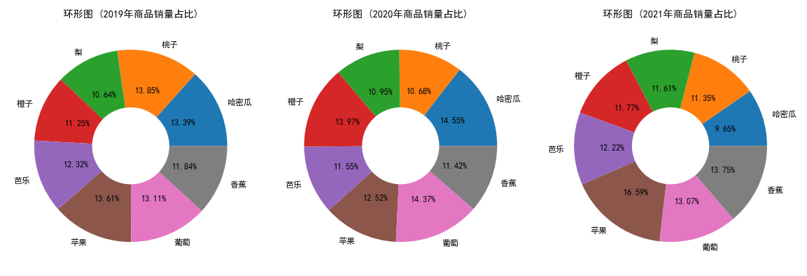
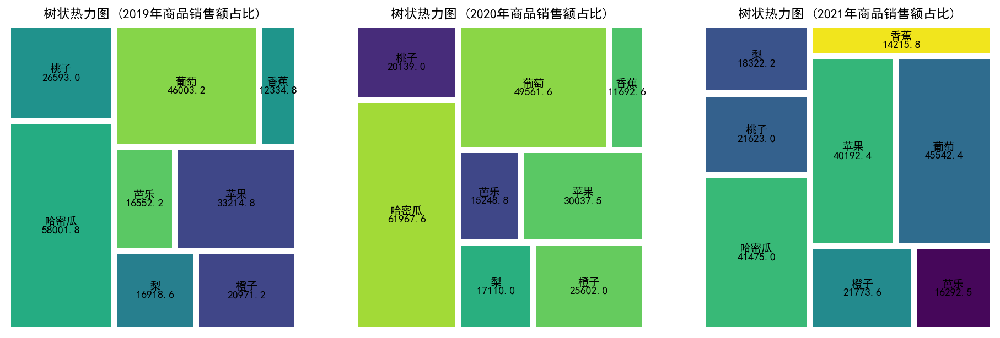
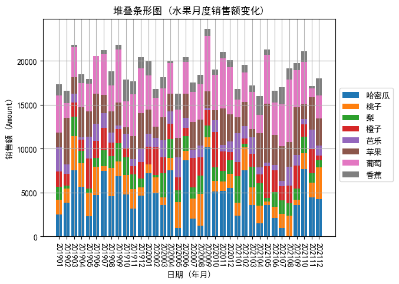
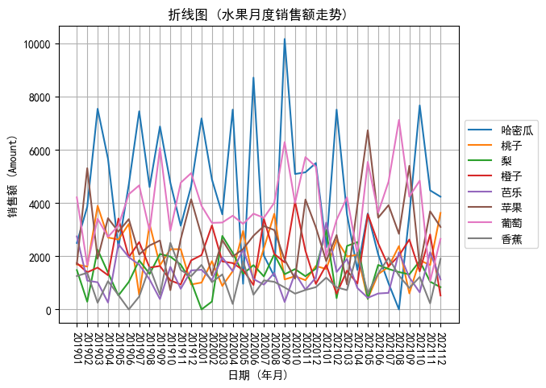

# 文章_数据分析_商品维度占比及变化可视化分析(Pandas和Matplotlib)_GF_2023-07-24

分析维度包括:

1. 各商品年度销量占比

2. 各商品月度销量变化

## 构建测试数据

这里你可以了解到:

* 如何生成时间相关的数据。

* 如何从列表（可迭代对象）中生成随机数据。

* Pandas 的 DataFrame 自行创建，包含生成新字段。

* Pandas 数据合并。

**(1) 构建数据: 时间字段**:

```python
time_range = pd.date_range(start="2019/01/01", end="2021/12/31")

print("[Message] Time Range Built Through Pandas:")
print(time_range)

print("[Message] Time Length Built Through Pandas:")
print(len(time_range))
```

输出:

```txt
[Message] Time Range Built Through Pandas:
DatetimeIndex(['2019-01-01', '2019-01-02', '2019-01-03', '2019-01-04',
               '2019-01-05', '2019-01-06', '2019-01-07', '2019-01-08',
               '2019-01-09', '2019-01-10',
               ...
               '2021-12-22', '2021-12-23', '2021-12-24', '2021-12-25',
               '2021-12-26', '2021-12-27', '2021-12-28', '2021-12-29',
               '2021-12-30', '2021-12-31'],
              dtype='datetime64[ns]', length=1096, freq='D')
[Message] Time Length Built Through Pandas:
1096
```

**(2) 构建数据: 水果列表**:

```python
fruits = ["香蕉", "苹果", "葡萄", "橙子", "哈密瓜", "芭乐", "梨", "桃子"]
fruits_list = np.random.choice(fruits, size=len(time_range), replace=True)

print("[Message] Fruits List Built Through NumPy:")
print(fruits_list)

print("[Message] Length of Fruits List Built Through NumPy:")
print(len(fruits_list))
```

输出:

```txt
[Message] Fruits List Built Through NumPy:
['香蕉' '葡萄' '香蕉' ... '香蕉' '橙子' '桃子']
[Message] Length of Fruits List Built Through NumPy:
1096
```

**(3) 构建数据: 客户列表**:

```python
names = ["Mike", "Jhon", "Tom", "Xiaoming", "Jimmy", "Lym", "Michk"]
names_list = np.random.choice(names, size=len(time_range), replace=True)

print("[Message] Customer List Built Through NumPy:")
print(names_list)

print("[Message] Length of Customer List Built Through NumPy:")
print(len(names_list))
```

输出:

```txt
[Message] Customer List Built Through NumPy:
['Mike' 'Michk' 'Michk' ... 'Xiaoming' 'Jhon' 'Lym']
[Message] Length of Customer List Built Through NumPy:
1096
```

**(4) 构建数据: 订单数据**:

```python
order = pd.DataFrame({"time": time_range,   # -> 下单时间。
                      "fruit": fruits_list, # -> 水果名称。
                      "name": names_list,   # -> 顾客名。
                      "kilogram": np.random.choice(list(range(50,100)), size=len(time_range),replace=True)}) # -> 购买量。

print("[Message] Generate Order Data Through Pandas DataFrame:")
print(order)
```

输出:

```txt
[Message] Generate Order Data Through Pandas DataFrame:
            time  fruit      name  kilogram
0     2019-01-01   香蕉      Mike        63
1     2019-01-02   葡萄     Michk        69
2     2019-01-03   香蕉     Michk        51
3     2019-01-04   香蕉      Mike        69
4     2019-01-05   香蕉       Tom        64
...          ...    ...       ...       ...
1091  2021-12-27   葡萄       Lym        94
1092  2021-12-28     梨  Xiaoming        60
1093  2021-12-29   香蕉  Xiaoming        95
1094  2021-12-30   橙子      Jhon        90
1095  2021-12-31   桃子       Lym        93

[1096 rows x 4 columns]
```

**(5) 构建数据: 水果信息**:

```python
information = pd.DataFrame({"fruit": fruits,
                            "price": [3.8, 8.9, 12.8, 6.8, 15.8, 4.9, 5.8, 7],
                            "region": ["华南", "华北", "西北", "华中", "西北", "华南", "华北", "华中"]})

print("[Message] Building Fruits Information Through Pandas DataFrame:")
print(information)
```

输出:

```txt
[Message] Building Fruits Information Through Pandas DataFrame:
    fruit  price  region
0    香蕉    3.8    华南
1    苹果    8.9    华北
2    葡萄   12.8    西北
3    橙子    6.8    华中
4  哈密瓜   15.8    西北
5    芭乐    4.9    华南
6      梨    5.8    华北
7    桃子    7.0    华中
```

**(6) 构建数据: 合并订单数据和水果信息**:

```python
# 将订单信息和水果信息直接合并成一个完整的 DataFrame, 这个 df 就是要用到的测试数据。
df = pd.merge(order, information, how="outer").sort_values("time").reset_index(drop=True)

print("[Message] Merge Order Data and Fruits Information Through Pandas DataFrame:")
print(df)
```

输出:

```txt
[Message] Merge Order Data and Fruits Information Through Pandas DataFrame:
            time  fruit      name  kilogram  price  region
0     2019-01-01   香蕉      Mike        63    3.8    华南
1     2019-01-02   葡萄     Michk        69   12.8    西北
2     2019-01-03   香蕉     Michk        51    3.8    华南
3     2019-01-04   香蕉      Mike        69    3.8    华南
4     2019-01-05   香蕉       Tom        64    3.8    华南
...          ...    ...       ...       ...    ...   ...
1091  2021-12-27   葡萄       Lym        94   12.8    西北
1092  2021-12-28     梨  Xiaoming        60    5.8    华北
1093  2021-12-29   香蕉  Xiaoming        95    3.8    华南
1094  2021-12-30   橙子      Jhon        90    6.8    华中
1095  2021-12-31   桃子       Lym        93    7.0    华中

[1096 rows x 6 columns]
```

**(7) 构建数据: 计算订单金额**:

```python
df["amount"] = df["kilogram"] * df["price"]

print("[Message] Compute Order Amount Through Pandas DataFrame:")
print(df.head())
```

输出:

```txt
[Message] Compute Order Amount Through Pandas DataFrame:
         time  fruit   name  kilogram  price  region  amount
0  2019-01-01   香蕉   Mike        63    3.8    华南   239.4
1  2019-01-02   葡萄  Michk        69   12.8    西北   883.2
2  2019-01-03   香蕉  Michk        51    3.8    华南   193.8
3  2019-01-04   香蕉   Mike        69    3.8    华南   262.2
4  2019-01-05   香蕉    Tom        64    3.8    华南   243.2
```

## 配置 Matplotlib (全局配置)

```python
# 指定 Matplotlib 默认字体 (解决中文无法显示的问题)。
plt.rcParams['font.sans-serif'] = ['SimHei']

# 解决 Matplotlib 保存图像时负号 "-" 显示方块的问题。
plt.rcParams['axes.unicode_minus'] = False

# 设置 Matplotlib 字体大小 (全局生效)。
plt.rcParams['font.size'] = 6
```

## 各商品年度销量和销售额数据

**提取年份**:

```python
# 提取日期中的年份。
df["year"] = df["time"].dt.year
```

**计算各商品的年度销量和销售额数据**:

```python
# 计算各水果的年度销量和销售额数据。
annual_data = df.groupby(["year", "fruit"]).agg({"kilogram":"sum", "amount":"sum"}).reset_index()
annual_data["year"] =   annual_data["year"].astype(str)
annual_data["amount"] = annual_data["amount"].apply(lambda x: round(x, 2))

print("[Message] Top 10 Lines of Annual Quantity and Amount Data:")
print(annual_data.head(10))
```

输出:

```txt
[Message] Top 10 Lines of Annual Quantity and Amount Data:
   year   fruit  kilogram   amount
0  2019  哈密瓜      3671  58001.8
1  2019    桃子      3799  26593.0
2  2019      梨      2917  16918.6
3  2019    橙子      3084  20971.2
4  2019    芭乐      3378  16552.2
5  2019    苹果      3732  33214.8
6  2019    葡萄      3594  46003.2
7  2019    香蕉      3246  12334.8
8  2020  哈密瓜      3922  61967.6
9  2020    桃子      2877  20139.0
```

## 绘制商品年度销量占比和销售额占比

**绘制各商品的年度销量占比环形图**:

绘制 Matplotlib 环形图: 通过向 matplotlib.pyplot 的 .pie 方法传递参数 wedgeprops={'width':0.6} 绘制，自定义数值 0.6 表示环形图的宽度。

```python
# 创建一个 10 * 32 点的图，设置分辨率为 144。
fig = plt.figure(figsize=(10, 32), dpi=144)

filter_data = annual_data[annual_data.year == "2019"]
ax1 = plt.subplot2grid((10, 32), (0, 0), rowspan=10, colspan=10)
ax1.pie(filter_data["kilogram"], labels=filter_data["fruit"], autopct='%1.2f%%', wedgeprops={'width':0.6})
ax1.set_title("环形图 (2019年商品销量占比)")

filter_data = annual_data[annual_data.year == "2020"]
ax2 = plt.subplot2grid((10, 32), (0, 11), rowspan=10, colspan=10)
ax2.pie(filter_data["kilogram"], labels=filter_data["fruit"], autopct='%1.2f%%', wedgeprops={'width':0.6})
ax2.set_title("环形图 (2020年商品销量占比)")

filter_data = annual_data[annual_data.year == "2021"]
ax3 = plt.subplot2grid((10, 32), (0, 22), rowspan=10, colspan=10)
ax3.pie(filter_data["kilogram"], labels=filter_data["fruit"], autopct='%1.2f%%', wedgeprops={'width':0.6})
ax3.set_title("环形图 (2021年商品销量占比)")

plt.show()
```

预览:



**绘制各商品的年度销售额树状热力图**:

绘制 Matplotlib 树状热力图: 在 Matplotlib 中绘制树状热力图, 需要先 Pip 安装 squarify, 然后 import squarify 后即可调用 squarify.plot 方法。

```python
# 重置 Matplotlib 字体大小 (全局生效)。
plt.rcParams['font.size'] = 10

# 创建一个 16 * 5 点的图，设置分辨率为 144。
fig = plt.figure(figsize=(16, 5), dpi=144)

filter_data = annual_data[annual_data.year == "2019"]
plt.subplot(1,3,1)
squarify.plot(filter_data["amount"],
              #color=['red', 'green', 'blue', 'orange'],
              label=filter_data["fruit"],
              value=filter_data["amount"],
              pad=True)
plt.title("树状热力图 (2019年商品销售额占比)")
plt.axis('off')

filter_data = annual_data[annual_data.year == "2020"]
plt.subplot(1,3,2)
squarify.plot(filter_data["amount"],
              #color=['red', 'green', 'blue', 'orange'],
              label=filter_data["fruit"],
              value=filter_data["amount"],
              pad=True)
plt.title("树状热力图 (2020年商品销售额占比)")
plt.axis('off')

filter_data = annual_data[annual_data.year == "2021"]
plt.subplot(1,3,3)
squarify.plot(filter_data["amount"],
              #color=['red', 'green', 'blue', 'orange'],
              label=filter_data["fruit"],
              value=filter_data["amount"],
              pad=True)
plt.title("树状热力图 (2021年商品销售额占比)")
plt.axis('off')

plt.show()
```

预览:



## 各商品月度销售额数据

**同时提取年份和月份**:

```python
# 同时提取日期中的年份和月份。
df["year_month"] = df["time"].dt.strftime('%Y%m')
```

**计算各商品的月度销售额数据**:

```python
# 计算各水果的月度销售额数据。
monthly_data = df.groupby(["year_month", "fruit"])["amount"].sum().reset_index()

# 找出某些水果在哪些月份没有销售，并填充 0.0 便于绘图。
LIST_for_Year_Month = monthly_data["year_month"].drop_duplicates()
LIST_for_Fruit = monthly_data["fruit"].drop_duplicates()
# ..................................................
for ym in LIST_for_Year_Month:
    for fru in LIST_for_Fruit:
        
        filtered_line = monthly_data[(monthly_data.year_month == ym) & (monthly_data.fruit == fru)]
        
        if filtered_line.empty == True:
            
            new_line = {"year_month": ym, "fruit": fru, "amount": 0.0}
            # FutureWarning: The frame.append method is deprecated and will be removed from pandas in a future version. Use pandas.concat instead.
            monthly_data = monthly_data.append(new_line, ignore_index=True)
            
        else:         
            pass

print("[Message] Monthly Amount Data:")
print(monthly_data)
```

输出:

```txt
[Message] Monthly Amount Data:
    year_month   fruit  amount
0       201901  哈密瓜  2496.4
1       201901    桃子  1687.0
2       201901      梨  1479.0
3       201901    橙子  1740.8
4       201901    芭乐  2744.0
..         ...     ...     ...
280     202112    橙子   523.6
281     202112    芭乐  1127.0
282     202112    苹果  3097.2
283     202112    葡萄  2649.6
284     202112    香蕉  1900.0

[285 rows x 3 columns]
```

## 绘制商品月销售额变化

**绘制各商品的月度销售额堆叠条形图**:

```python
monthly_data = monthly_data.sort_values("year_month", ascending=True)
LIST_for_Year_Month = monthly_data["year_month"].drop_duplicates()
LIST_for_Fruit = monthly_data["fruit"].drop_duplicates()
LIST_for_Bottom = [i - i for i in range(len(LIST_for_Year_Month))]
# ..................................................
for i in range(len(LIST_for_Fruit)):
    
    if (i == 0):
        
        filter_data = monthly_data[monthly_data.fruit == LIST_for_Fruit[i]]
        X_axis = LIST_for_Year_Month
        Y_axis = filter_data["amount"]
        plt.bar(X_axis, Y_axis, bottom=0, label=LIST_for_Fruit[i])
        
        LIST_for_Y_Axis = Y_axis.values.tolist()
        LIST_for_Bottom = [n + m for n, m in zip(LIST_for_Bottom, LIST_for_Y_Axis)]
        
    else:
        
        filter_data = monthly_data[monthly_data.fruit == LIST_for_Fruit[i]]
        X_axis = LIST_for_Year_Month
        Y_axis = filter_data["amount"]
        plt.bar(X_axis, Y_axis, bottom=LIST_for_Bottom, label=LIST_for_Fruit[i])
        
        LIST_for_Y_Axis = Y_axis.values.tolist()
        LIST_for_Bottom = [n + m for n, m in zip(LIST_for_Bottom, LIST_for_Y_Axis)]
# ..................................................
plt.title("堆叠条形图 (水果月度销售额变化)")
plt.xticks(rotation=-90) # -> 将 X 轴刻度标签旋转 90 度 (正数为逆时针，负数为顺时针)。
plt.xlabel("日期 (年月)")
plt.ylabel("销售额 (Amount)")
plt.grid(True)
# bbox_to_anchor 设置图例位置，参照官网，(1.0, 0.7) 这个数值将图例设置到图像外侧右边中间。
plt.legend(bbox_to_anchor=(1.0, 0.7))

plt.show()
```

预览:



**绘制各商品的月度销售额走势折线图**:

```python
monthly_data = monthly_data.sort_values("year_month", ascending=True)
LIST_for_Year_Month = monthly_data["year_month"].drop_duplicates()
LIST_for_Fruit = monthly_data["fruit"].drop_duplicates()
# ..................................................
for fru in LIST_for_Fruit:
        
    filter_data = monthly_data[monthly_data.fruit == fru]
    X_axis = LIST_for_Year_Month
    Y_axis = filter_data["amount"]
    plt.plot(X_axis, Y_axis, label=fru)
# ..................................................
plt.title("折线图 (水果月度销售额走势)")
plt.xticks(rotation=-90) # -> 将 X 轴刻度标签旋转 90 度 (正数为逆时针，负数为顺时针)。
plt.xlabel("日期 (年月)")
plt.ylabel("销售额 (Amount)")
plt.grid(True)
# bbox_to_anchor 设置图例位置，参照官网，(1.0, 0.7) 这个数值将图例设置到图像外侧右边中间。
plt.legend(bbox_to_anchor=(1.0, 0.7))

plt.show()
```

预览:



## 完整代码

```python
#!/usr/bin/python3
# Create By GF 2023-07-24

# 分析维度包括:
# 1. 各商品年度销量占比
# 2. 各商品月度销量变化

import numpy as np
import pandas as pd
from matplotlib import pyplot as plt
import squarify

# (1) 构建数据: 时间字段。
time_range = pd.date_range(start="2019/01/01", end="2021/12/31")

print("[Message] Time Range Built Through Pandas:")
print(time_range)

print("[Message] Time Length Built Through Pandas:")
print(len(time_range))

# (2) 构建数据: 水果列表。
fruits = ["香蕉", "苹果", "葡萄", "橙子", "哈密瓜", "芭乐", "梨", "桃子"]
fruits_list = np.random.choice(fruits, size=len(time_range), replace=True)

print("[Message] Fruits List Built Through NumPy:")
print(fruits_list)

print("[Message] Length of Fruits List Built Through NumPy:")
print(len(fruits_list))

# (2) 构建数据: 客户列表。
names = ["Mike", "Jhon", "Tom", "Xiaoming", "Jimmy", "Lym", "Michk"]
names_list = np.random.choice(names, size=len(time_range), replace=True)

print("[Message] Customer List Built Through NumPy:")
print(names_list)

print("[Message] Length of Customer List Built Through NumPy:")
print(len(names_list))

# (4) 构建数据: 订单数据。
order = pd.DataFrame({"time": time_range,   # -> 下单时间。
                      "fruit": fruits_list, # -> 水果名称。
                      "name": names_list,   # -> 顾客名。
                      "kilogram": np.random.choice(list(range(50,100)), size=len(time_range),replace=True)}) # -> 购买量。

print("[Message] Generate Order Data Through Pandas DataFrame:")
print(order)

# (5) 构建数据: 水果信息。
information = pd.DataFrame({"fruit": fruits,
                            "price": [3.8, 8.9, 12.8, 6.8, 15.8, 4.9, 5.8, 7],
                            "region": ["华南", "华北", "西北", "华中", "西北", "华南", "华北", "华中"]})

print("[Message] Building Fruits Information Through Pandas DataFrame:")
print(information)

# (6) 构建数据: 合并订单数据和水果信息。
# 将订单信息和水果信息直接合并成一个完整的 DataFrame, 这个 df 就是要用到的测试数据。
df = pd.merge(order, information, how="outer").sort_values("time").reset_index(drop=True)

print("[Message] Merge Order Data and Fruits Information Through Pandas DataFrame:")
print(df)

# (7) 构建数据: 计算订单金额。
df["amount"] = df["kilogram"] * df["price"]

print("[Message] Compute Order Amount Through Pandas DataFrame:")
print(df.head())

# ####################################################################################################

# 指定 Matplotlib 默认字体 (解决中文无法显示的问题)。
plt.rcParams['font.sans-serif'] = ['SimHei']

# 解决 Matplotlib 保存图像时负号 "-" 显示方块的问题。
plt.rcParams['axes.unicode_minus'] = False

# 设置 Matplotlib 字体大小 (全局生效)。
plt.rcParams['font.size'] = 6

# ####################################################################################################

# 提取日期中的年份。
df["year"] = df["time"].dt.year

# 计算各水果的年度销量和销售额数据。
annual_data = df.groupby(["year", "fruit"]).agg({"kilogram":"sum", "amount":"sum"}).reset_index()
annual_data["year"] =   annual_data["year"].astype(str)
annual_data["amount"] = annual_data["amount"].apply(lambda x: round(x, 2))

print("[Message] Top 10 Lines of Annual Quantity and Amount Data:")
print(annual_data.head(10))

# ####################################################################################################
# 绘制各商品的年度销量占比环形图

# 创建一个 10 * 32 点的图，设置分辨率为 144。
fig = plt.figure(figsize=(10, 32), dpi=144)

filter_data = annual_data[annual_data.year == "2019"]
ax1 = plt.subplot2grid((10, 32), (0, 0), rowspan=10, colspan=10)
ax1.pie(filter_data["kilogram"], labels=filter_data["fruit"], autopct='%1.2f%%', wedgeprops={'width':0.6})
ax1.set_title("环形图 (2019年商品销量占比)")

filter_data = annual_data[annual_data.year == "2020"]
ax2 = plt.subplot2grid((10, 32), (0, 11), rowspan=10, colspan=10)
ax2.pie(filter_data["kilogram"], labels=filter_data["fruit"], autopct='%1.2f%%', wedgeprops={'width':0.6})
ax2.set_title("环形图 (2020年商品销量占比)")

filter_data = annual_data[annual_data.year == "2021"]
ax3 = plt.subplot2grid((10, 32), (0, 22), rowspan=10, colspan=10)
ax3.pie(filter_data["kilogram"], labels=filter_data["fruit"], autopct='%1.2f%%', wedgeprops={'width':0.6})
ax3.set_title("环形图 (2021年商品销量占比)")

plt.show()

# ####################################################################################################
# 绘制各商品的年度销售额树状热力图

# 重置 Matplotlib 字体大小 (全局生效)。
plt.rcParams['font.size'] = 10

# 创建一个 16 * 5 点的图，设置分辨率为 144。
fig = plt.figure(figsize=(16, 5), dpi=144)

filter_data = annual_data[annual_data.year == "2019"]
plt.subplot(1,3,1)
squarify.plot(filter_data["amount"],
              #color=['red', 'green', 'blue', 'orange'],
              label=filter_data["fruit"],
              value=filter_data["amount"],
              pad=True)
plt.title("树状热力图 (2019年商品销售额占比)")
plt.axis('off')

filter_data = annual_data[annual_data.year == "2020"]
plt.subplot(1,3,2)
squarify.plot(filter_data["amount"],
              #color=['red', 'green', 'blue', 'orange'],
              label=filter_data["fruit"],
              value=filter_data["amount"],
              pad=True)
plt.title("树状热力图 (2020年商品销售额占比)")
plt.axis('off')

filter_data = annual_data[annual_data.year == "2021"]
plt.subplot(1,3,3)
squarify.plot(filter_data["amount"],
              #color=['red', 'green', 'blue', 'orange'],
              label=filter_data["fruit"],
              value=filter_data["amount"],
              pad=True)
plt.title("树状热力图 (2021年商品销售额占比)")
plt.axis('off')

plt.show()

# ####################################################################################################

# 同时提取日期中的年份和月份。
df["year_month"] = df["time"].dt.strftime('%Y%m')

# 计算各水果的月度销售额数据。
monthly_data = df.groupby(["year_month", "fruit"])["amount"].sum().reset_index()

# 找出某些水果在哪些月份没有销售，并填充 0.0 便于绘图。
LIST_for_Year_Month = monthly_data["year_month"].drop_duplicates()
LIST_for_Fruit = monthly_data["fruit"].drop_duplicates()
# ..................................................
for ym in LIST_for_Year_Month:
    for fru in LIST_for_Fruit:
        
        filtered_line = monthly_data[(monthly_data.year_month == ym) & (monthly_data.fruit == fru)]
        
        if filtered_line.empty == True:
            
            new_line = {"year_month": ym, "fruit": fru, "amount": 0.0}
            # FutureWarning: The frame.append method is deprecated and will be removed from pandas in a future version. Use pandas.concat instead.
            monthly_data = monthly_data.append(new_line, ignore_index=True)
            
        else:         
            pass

print("[Message] Monthly Amount Data:")
print(monthly_data)

# ####################################################################################################
# 绘制各商品的月度销售额堆叠条形图

monthly_data = monthly_data.sort_values("year_month", ascending=True)
LIST_for_Year_Month = monthly_data["year_month"].drop_duplicates()
LIST_for_Fruit = monthly_data["fruit"].drop_duplicates()
LIST_for_Bottom = [i - i for i in range(len(LIST_for_Year_Month))]
# ..................................................
for i in range(len(LIST_for_Fruit)):
    
    if (i == 0):
        
        filter_data = monthly_data[monthly_data.fruit == LIST_for_Fruit[i]]
        X_axis = LIST_for_Year_Month
        Y_axis = filter_data["amount"]
        plt.bar(X_axis, Y_axis, bottom=0, label=LIST_for_Fruit[i])
        
        LIST_for_Y_Axis = Y_axis.values.tolist()
        LIST_for_Bottom = [n + m for n, m in zip(LIST_for_Bottom, LIST_for_Y_Axis)]
        
    else:
        
        filter_data = monthly_data[monthly_data.fruit == LIST_for_Fruit[i]]
        X_axis = LIST_for_Year_Month
        Y_axis = filter_data["amount"]
        plt.bar(X_axis, Y_axis, bottom=LIST_for_Bottom, label=LIST_for_Fruit[i])
        
        LIST_for_Y_Axis = Y_axis.values.tolist()
        LIST_for_Bottom = [n + m for n, m in zip(LIST_for_Bottom, LIST_for_Y_Axis)]
# ..................................................
plt.title("堆叠条形图 (水果月度销售额变化)")
plt.xticks(rotation=-90) # -> 将 X 轴刻度标签旋转 90 度 (正数为逆时针，负数为顺时针)。
plt.xlabel("日期 (年月)")
plt.ylabel("销售额 (Amount)")
plt.grid(True)
# bbox_to_anchor 设置图例位置，参照官网，(1.0, 0.7) 这个数值将图例设置到图像外侧右边中间。
plt.legend(bbox_to_anchor=(1.0, 0.7))

plt.show()

# ####################################################################################################
# 绘制各商品的月度销售额走势折线图

monthly_data = monthly_data.sort_values("year_month", ascending=True)
LIST_for_Year_Month = monthly_data["year_month"].drop_duplicates()
LIST_for_Fruit = monthly_data["fruit"].drop_duplicates()
# ..................................................
for fru in LIST_for_Fruit:
        
    filter_data = monthly_data[monthly_data.fruit == fru]
    X_axis = LIST_for_Year_Month
    Y_axis = filter_data["amount"]
    plt.plot(X_axis, Y_axis, label=fru)
# ..................................................
plt.title("折线图 (水果月度销售额走势)")
plt.xticks(rotation=-90) # -> 将 X 轴刻度标签旋转 90 度 (正数为逆时针，负数为顺时针)。
plt.xlabel("日期 (年月)")
plt.ylabel("销售额 (Amount)")
plt.grid(True)
# bbox_to_anchor 设置图例位置，参照官网，(1.0, 0.7) 这个数值将图例设置到图像外侧右边中间。
plt.legend(bbox_to_anchor=(1.0, 0.7))

plt.show()

```

## 总结

以上就是关于 数据分析 商品维度占比及变化可视化分析(Pandas和Matplotlib) 的全部内容。

更多内容可以访问我的代码仓库:

https://gitee.com/goufeng928/public

https://github.com/goufeng928/public
