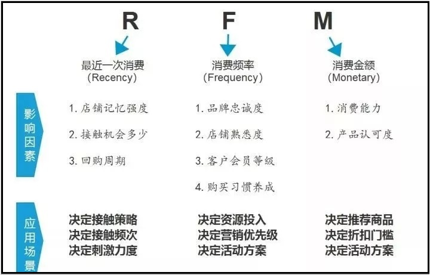
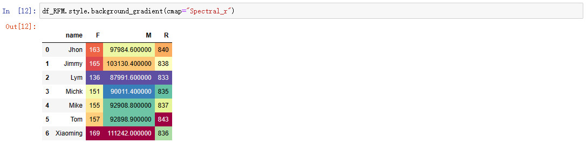

# 文章_数据分析_基于Pandas的用户分层RFM模型_GF_2023-07-28

RFM 模型是衡量客户价值和客户创造利益能力的重要工具和手段。

在众多的客户关系管理 (CRM) 的分析模式中, RFM 模型是被广泛提到的。

该机械模型通过一个客户的近期购买行为, 购买的总体频率以及花了多少钱 3 项指标来描述该客户的价值状况。

根据美国数据库营销研究所 Arthur Hughes 的研究, 客户数据库中有 3 个神奇的要素, 这 3 个要素构成了数据分析最好的指标:

* 最近一次消费 (Recency)

* 消费频率 (Frequency)

* 消费金额 (Monetary)

**用户分层 RFM 模型图示**:


**用户分层 RFM 模型应用实例 (生鲜平台)**:


**用户分层 RFM 营销策略**:



## 构建测试数据

这里你可以了解到:

* 如何生成时间相关的数据。

* 如何从列表（可迭代对象）中生成随机数据。

* Pandas 的 DataFrame 自行创建，包含生成新字段。

* Pandas 数据合并。

**(1) 构建数据: 时间字段**:

```python
time_range = pd.date_range(start="2019/01/01", end="2021/12/31")

print("[Message] Time Range Built Through Pandas:")
print(time_range)

print("[Message] Time Length Built Through Pandas:")
print(len(time_range))
```

输出:

```txt
[Message] Time Range Built Through Pandas:
DatetimeIndex(['2019-01-01', '2019-01-02', '2019-01-03', '2019-01-04',
               '2019-01-05', '2019-01-06', '2019-01-07', '2019-01-08',
               '2019-01-09', '2019-01-10',
               ...
               '2021-12-22', '2021-12-23', '2021-12-24', '2021-12-25',
               '2021-12-26', '2021-12-27', '2021-12-28', '2021-12-29',
               '2021-12-30', '2021-12-31'],
              dtype='datetime64[ns]', length=1096, freq='D')
[Message] Time Length Built Through Pandas:
1096
```

**(2) 构建数据: 水果列表**:

```python
fruits = ["香蕉", "苹果", "葡萄", "橙子", "哈密瓜", "芭乐", "梨", "桃子"]
fruits_list = np.random.choice(fruits, size=len(time_range), replace=True)

print("[Message] Fruits List Built Through NumPy:")
print(fruits_list)

print("[Message] Length of Fruits List Built Through NumPy:")
print(len(fruits_list))
```

输出:

```txt
[Message] Fruits List Built Through NumPy:
['香蕉' '葡萄' '香蕉' ... '香蕉' '橙子' '桃子']
[Message] Length of Fruits List Built Through NumPy:
1096
```

**(3) 构建数据: 客户列表**:

```python
names = ["Mike", "Jhon", "Tom", "Xiaoming", "Jimmy", "Lym", "Michk"]
names_list = np.random.choice(names, size=len(time_range), replace=True)

print("[Message] Customer List Built Through NumPy:")
print(names_list)

print("[Message] Length of Customer List Built Through NumPy:")
print(len(names_list))
```

输出:

```txt
[Message] Customer List Built Through NumPy:
['Mike' 'Michk' 'Michk' ... 'Xiaoming' 'Jhon' 'Lym']
[Message] Length of Customer List Built Through NumPy:
1096
```

**(4) 构建数据: 订单数据**:

```python
order = pd.DataFrame({"time": time_range,   # -> 下单时间。
                      "fruit": fruits_list, # -> 水果名称。
                      "name": names_list,   # -> 顾客名。
                      "kilogram": np.random.choice(list(range(50,100)), size=len(time_range),replace=True)}) # -> 购买量。

print("[Message] Generate Order Data Through Pandas DataFrame:")
print(order)
```

输出:

```txt
[Message] Generate Order Data Through Pandas DataFrame:
            time  fruit      name  kilogram
0     2019-01-01   香蕉      Mike        63
1     2019-01-02   葡萄     Michk        69
2     2019-01-03   香蕉     Michk        51
3     2019-01-04   香蕉      Mike        69
4     2019-01-05   香蕉       Tom        64
...          ...    ...       ...       ...
1091  2021-12-27   葡萄       Lym        94
1092  2021-12-28     梨  Xiaoming        60
1093  2021-12-29   香蕉  Xiaoming        95
1094  2021-12-30   橙子      Jhon        90
1095  2021-12-31   桃子       Lym        93

[1096 rows x 4 columns]
```

**(5) 构建数据: 水果信息**:

```python
information = pd.DataFrame({"fruit": fruits,
                            "price": [3.8, 8.9, 12.8, 6.8, 15.8, 4.9, 5.8, 7],
                            "region": ["华南", "华北", "西北", "华中", "西北", "华南", "华北", "华中"]})

print("[Message] Building Fruits Information Through Pandas DataFrame:")
print(information)
```

输出:

```txt
[Message] Building Fruits Information Through Pandas DataFrame:
    fruit  price  region
0    香蕉    3.8    华南
1    苹果    8.9    华北
2    葡萄   12.8    西北
3    橙子    6.8    华中
4  哈密瓜   15.8    西北
5    芭乐    4.9    华南
6      梨    5.8    华北
7    桃子    7.0    华中
```

**(6) 构建数据: 合并订单数据和水果信息**:

```python
# 将订单信息和水果信息直接合并成一个完整的 DataFrame, 这个 df 就是要用到的测试数据。
df = pd.merge(order, information, how="outer").sort_values("time").reset_index(drop=True)

print("[Message] Merge Order Data and Fruits Information Through Pandas DataFrame:")
print(df)
```

输出:

```txt
[Message] Merge Order Data and Fruits Information Through Pandas DataFrame:
            time  fruit      name  kilogram  price  region
0     2019-01-01   香蕉      Mike        63    3.8    华南
1     2019-01-02   葡萄     Michk        69   12.8    西北
2     2019-01-03   香蕉     Michk        51    3.8    华南
3     2019-01-04   香蕉      Mike        69    3.8    华南
4     2019-01-05   香蕉       Tom        64    3.8    华南
...          ...    ...       ...       ...    ...   ...
1091  2021-12-27   葡萄       Lym        94   12.8    西北
1092  2021-12-28     梨  Xiaoming        60    5.8    华北
1093  2021-12-29   香蕉  Xiaoming        95    3.8    华南
1094  2021-12-30   橙子      Jhon        90    6.8    华中
1095  2021-12-31   桃子       Lym        93    7.0    华中

[1096 rows x 6 columns]
```

**(7) 构建数据: 计算订单金额**:

```python
df["amount"] = df["kilogram"] * df["price"]

print("[Message] Compute Order Amount Through Pandas DataFrame:")
print(df.head())
```

输出:

```txt
[Message] Compute Order Amount Through Pandas DataFrame:
         time  fruit   name  kilogram  price  region  amount
0  2019-01-01   香蕉   Mike        63    3.8    华南   239.4
1  2019-01-02   葡萄  Michk        69   12.8    西北   883.2
2  2019-01-03   香蕉  Michk        51    3.8    华南   193.8
3  2019-01-04   香蕉   Mike        69    3.8    华南   262.2
4  2019-01-05   香蕉    Tom        64    3.8    华南   243.2
```

## 计算 RFM 模型数据

RFM 模型是衡量客户价值和创利能力的重要工具和手段。

通过这个模型能够反映一个用户的交期交易行为, 交易的总体频率和总交易金额 3 项指标, 通过 3 个指标来描述该客户的价值状况; 同时依据这三项指标将客户划分为 8 类客户价值:

* Recency (R) 是客户最近一次购买日期距离现在的天数, 这个指标与分析的时间点有关, 因此是变动的。理论上客户越是在近期发生购买行为, 就越有可能复购。

* Frequency (F) 指的是客户发生购买行为的次数 – 最常购买的消费者, 忠诚度也就较高。增加顾客购买的次数意味着能占有更多的时长份额。

* Monetary Value (M) 是客户购买花费的总金额。

**查看字段数据类型**:

```python
print("[Message] View Field Data Types in Pandas DataFrame:")
print(df.dtypes)
```

输出:

```txt
time        datetime64[ns]
fruit               object
name                object
kilogram             int32
price              float64
region              object
amount             float64
dtype: object
```

**(1) 计算 RFM 模型数据: 计算 F 和 M 值**:

```python
# 通过 Pandas 的多个方法来分别求解 RFM 模型的 3 个指标, 首先是 F 和 M: 每位客户的订单次数和总金额。
df_F_M = df.groupby("name").agg({"fruit":"count", "amount":"sum"}).reset_index().rename(columns={"fruit":"F", "amount":"M"})

print("[Message] Calculate F and M in RFM Through Pandas DataFrame:")
print(df_F_M)
```

输出:

```txt
[Message] Calculate F and M in RFM Through Pandas DataFrame:
       name    F         M
0      Jhon  155   97036.7
1     Jimmy  155   87565.9
2       Lym  151   96158.4
3     Michk  187  110111.3
4      Mike  150   89997.7
5       Tom  138   86910.4
6  Xiaoming  160   90885.0
```

**(2) 计算 RFM 模型数据: 计算 R 值**:

```python
print("Current Time:", datetime.datetime.now()) # datetime.datetime.now() 返回当前时间。

# 先求解每个订单和当前时间的差值。
df["time_diff"] = df["time"].apply(lambda x: (datetime.datetime.now() - x).days)

print("[Message] Calculate Per Order Time Difference in Pandas DataFrame:")
print(df.head())

# 根据每个用户的时间差进行升序排列, 排在第一位的那条数据就是他最近购买记录: 以 xiaoming 用户为例, 最近一次是 2021 年 12 月 29 号, 和当前时间的差值是 835 天。
print("[Message] Sort Customer Names by Order Time Difference in Pandas DataFrame:")
print(df.sort_values(["name", "time_diff"], ascending=[False, True]).head(10))

# 根据用户名去重, 保留第一条数据, 这样便得到每个用户的 R 指标。
df_R = df.sort_values(["name", "time_diff"], ascending=[False, True]).drop_duplicates(["name"], keep="first")
df_R = df_R[["name", "time_diff"]].rename(columns={"time_diff": "R"})

print("[Message] Calculate R in RFM in Pandas DataFrame:")
print(df_R)
```

输出:

```txt
Current Time: 2024-04-12 20:46:54.057401
[Message] Calculate Per Order Time Difference in Pandas DataFrame:
         time  fruit   name  kilogram  price  region  amount  time_diff
0  2019-01-01   香蕉   Mike        63    3.8    华南   239.4       1928
1  2019-01-02   葡萄  Michk        69   12.8    西北   883.2       1927
2  2019-01-03   香蕉  Michk        51    3.8    华南   193.8       1926
3  2019-01-04   香蕉   Mike        69    3.8    华南   262.2       1925
4  2019-01-05   香蕉    Tom        64    3.8    华南   243.2       1924
[Message] Sort Customer Names by Order Time Difference in Pandas DataFrame:
            time   fruit      name  kilogram  price  region  amount  time_diff
1093  2021-12-29    香蕉  Xiaoming        95    3.8    华南   361.0        835
1092  2021-12-28      梨  Xiaoming        60    5.8    华北   348.0        836
1080  2021-12-16  哈密瓜  Xiaoming        88   15.8    西北  1390.4        848
1074  2021-12-10    苹果  Xiaoming        71    8.9    华北   631.9        854
1067  2021-12-03    橙子  Xiaoming        69    6.8    华中   469.2        861
1058  2021-11-24    橙子  Xiaoming        71    6.8    华中   482.8        870
1054  2021-11-20    葡萄  Xiaoming        56   12.8    西北   716.8        874
1052  2021-11-18    桃子  Xiaoming        59    7.0    华中   413.0        876
1051  2021-11-17    芭乐  Xiaoming        78    4.9    华南   382.2        877
1047  2021-11-13    桃子  Xiaoming        92    7.0    华中   644.0        881
[Message] Calculate R in RFM in Pandas DataFrame:
          name    R
1093  Xiaoming  835
1090       Tom  838
1084      Mike  844
1087     Michk  841
1095       Lym  833
1086     Jimmy  842
1094      Jhon  834
```

**(3) 计算 RFM 模型数据: 合并 RFM 模型数据**:

```python
df_RFM = pd.merge(df_F_M, df_R)

print("[Message] Merge RFM Data Through Pandas DataFrame:")
print(df_RFM)
```

输出:

```txt
[Message] Merge RFM Data Through Pandas DataFrame:
       name    F         M    R
0      Jhon  155   97036.7  834
1     Jimmy  155   87565.9  842
2       Lym  151   96158.4  833
3     Michk  187  110111.3  841
4      Mike  150   89997.7  844
5       Tom  138   86910.4  838
6  Xiaoming  160   90885.0  835
```

当数据量足够大, 用户足够多的时候, 就可以只用 RFM 模型来将用户分成 8 个类型。

## 其它 - DataFrame 单元格背景色

`Pandas` 中的 `.style` 方法可以对 `DataFrame` 进行样式设置。

`.style` 方法可以设置的项包括单元格的背景色, 字体颜色, 对齐方式等。

其中 `cmap` 参数指定了颜色映射表。

例如:

```python
.style.background_gradient(cmap='RdYlGn')
```

这里 `cmap='RdYlGn'` 使用了红黄绿三种颜色进行渐变。

**示例代码**:

```python
# .style.background_gradient 返回一个 <pandas.io.formats.style.Styler object at 0x0000018BB3680D90> 对象。
# 在 Jupyter Notebook 中可以看到效果。
df_RFM.style.background_gradient(cmap="Spectral_r") # -> cmap="Spectral_r" 指定了使用光谱色作为颜色映射。
```

预览:



## 完整代码

```python
#!/usr/bin/python3
# Create By GF 2023-07-28

# 当数据量足够大, 用户足够多的时候, 就可以只用 RFM 模型来将用户分成 8 个类型。

import datetime
import pandas as pd
import numpy as np

# (1) 构建数据: 时间字段。
time_range = pd.date_range(start="2019/01/01", end="2021/12/31")

print("[Message] Time Range Built Through Pandas:")
print(time_range)

print("[Message] Time Length Built Through Pandas:")
print(len(time_range))

# (2) 构建数据: 水果列表。
fruits = ["香蕉", "苹果", "葡萄", "橙子", "哈密瓜", "芭乐", "梨", "桃子"]
fruits_list = np.random.choice(fruits, size=len(time_range), replace=True)

print("[Message] Fruits List Built Through NumPy:")
print(fruits_list)

print("[Message] Length of Fruits List Built Through NumPy:")
print(len(fruits_list))

# (2) 构建数据: 客户列表。
names = ["Mike", "Jhon", "Tom", "Xiaoming", "Jimmy", "Lym", "Michk"]
names_list = np.random.choice(names, size=len(time_range), replace=True)

print("[Message] Customer List Built Through NumPy:")
print(names_list)

print("[Message] Length of Customer List Built Through NumPy:")
print(len(names_list))

# (4) 构建数据: 订单数据。
order = pd.DataFrame({"time": time_range,   # -> 下单时间。
                      "fruit": fruits_list, # -> 水果名称。
                      "name": names_list,   # -> 顾客名。
                      "kilogram": np.random.choice(list(range(50,100)), size=len(time_range),replace=True)}) # -> 购买量。

print("[Message] Generate Order Data Through Pandas DataFrame:")
print(order)

# (5) 构建数据: 水果信息。
information = pd.DataFrame({"fruit": fruits,
                            "price": [3.8, 8.9, 12.8, 6.8, 15.8, 4.9, 5.8, 7],
                            "region": ["华南", "华北", "西北", "华中", "西北", "华南", "华北", "华中"]})

print("[Message] Building Fruits Information Through Pandas DataFrame:")
print(information)

# (6) 构建数据: 合并订单数据和水果信息。
# 将订单信息和水果信息直接合并成一个完整的 DataFrame, 这个 df 就是要用到的测试数据。
df = pd.merge(order, information, how="outer").sort_values("time").reset_index(drop=True)

print("[Message] Merge Order Data and Fruits Information Through Pandas DataFrame:")
print(df)

# (7) 构建数据: 计算订单金额。
df["amount"] = df["kilogram"] * df["price"]

print("[Message] Compute Order Amount Through Pandas DataFrame:")
print(df.head())

# 查看字段数据类型。
print("[Message] View Field Data Types in Pandas DataFrame:")
print(df.dtypes)

# (1) 计算 RFM 模型数据: 计算 F 和 M 值。
# 通过 Pandas 的多个方法来分别求解 RFM 模型的 3 个指标, 首先是 F 和 M: 每位客户的订单次数和总金额。
df_F_M = df.groupby("name").agg({"fruit":"count", "amount":"sum"}).reset_index().rename(columns={"fruit":"F", "amount":"M"})

print("[Message] Calculate F and M in RFM Through Pandas DataFrame:")
print(df_F_M)

# (2) 计算 RFM 模型数据: 计算 R 值。
print("Current Time:", datetime.datetime.now()) # datetime.datetime.now() 返回当前时间。

# 先求解每个订单和当前时间的差值。
df["time_diff"] = df["time"].apply(lambda x: (datetime.datetime.now() - x).days)

print("[Message] Calculate Per Order Time Difference in Pandas DataFrame:")
print(df.head())

# 根据每个用户的时间差进行升序排列, 排在第一位的那条数据就是他最近购买记录: 以 xiaoming 用户为例, 最近一次是 2021 年 12 月 29 号, 和当前时间的差值是 835 天。
print("[Message] Sort Customer Names by Order Time Difference in Pandas DataFrame:")
print(df.sort_values(["name", "time_diff"], ascending=[False, True]).head(10))

# 根据用户名去重, 保留第一条数据, 这样便得到每个用户的 R 指标。
df_R = df.sort_values(["name", "time_diff"], ascending=[False, True]).drop_duplicates(["name"], keep="first")
df_R = df_R[["name", "time_diff"]].rename(columns={"time_diff": "R"})

print("[Message] Calculate R in RFM in Pandas DataFrame:")
print(df_R)

# (3) 计算 RFM 模型数据: 合并 RFM 模型数据。
df_RFM = pd.merge(df_F_M, df_R)

print("[Message] Merge RFM Data Through Pandas DataFrame:")
print(df_RFM)

```

## 总结

以上就是关于 数据分析 基于Pandas的用户分层RFM模型 的全部内容。

更多内容可以访问我的代码仓库:

https://gitee.com/goufeng928/public

https://github.com/goufeng928/public
