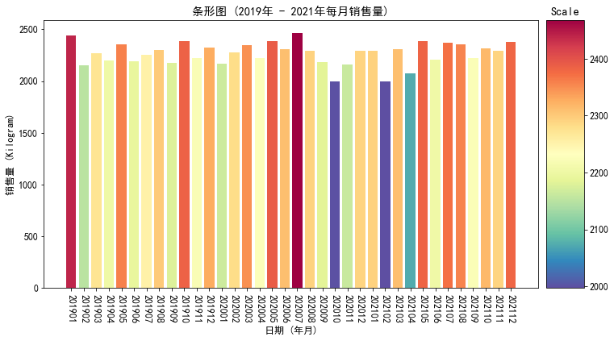
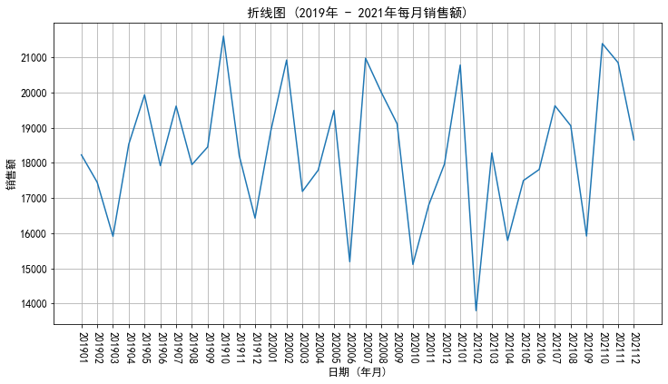

# 文章_数据分析_时间维度对比及变化可视化分析(Pandas和Matplotlib)_GF_2023-07-28

分析维度包括:

1. 各年度合计销量

2. 各年度合计销售额

3. 各年度平均每公斤销售额

4. 各月度销量对比

5. 各月度销售额变化

## 构建测试数据

这里你可以了解到:

* 如何生成时间相关的数据。

* 如何从列表（可迭代对象）中生成随机数据。

* Pandas 的 DataFrame 自行创建, 包含生成新字段。

* Pandas 数据合并。

**(1) 构建数据: 时间字段**:

```python
time_range = pd.date_range(start="2019/01/01", end="2021/12/31")

print("[Message] Time Range Built Through Pandas:")
print(time_range)

print("[Message] Time Length Built Through Pandas:")
print(len(time_range))
```

输出:

```txt
[Message] Time Range Built Through Pandas:
DatetimeIndex(['2019-01-01', '2019-01-02', '2019-01-03', '2019-01-04',
               '2019-01-05', '2019-01-06', '2019-01-07', '2019-01-08',
               '2019-01-09', '2019-01-10',
               ...
               '2021-12-22', '2021-12-23', '2021-12-24', '2021-12-25',
               '2021-12-26', '2021-12-27', '2021-12-28', '2021-12-29',
               '2021-12-30', '2021-12-31'],
              dtype='datetime64[ns]', length=1096, freq='D')
[Message] Time Length Built Through Pandas:
1096
```

**(2) 构建数据: 水果列表**:

```python
fruits = ["香蕉", "苹果", "葡萄", "橙子", "哈密瓜", "芭乐", "梨", "桃子"]
fruits_list = np.random.choice(fruits, size=len(time_range), replace=True)

print("[Message] Fruits List Built Through NumPy:")
print(fruits_list)

print("[Message] Length of Fruits List Built Through NumPy:")
print(len(fruits_list))
```

输出:

```txt
[Message] Fruits List Built Through NumPy:
['香蕉' '葡萄' '香蕉' ... '香蕉' '橙子' '桃子']
[Message] Length of Fruits List Built Through NumPy:
1096
```

**(3) 构建数据: 客户列表**:

```python
names = ["Mike", "Jhon", "Tom", "Xiaoming", "Jimmy", "Lym", "Michk"]
names_list = np.random.choice(names, size=len(time_range), replace=True)

print("[Message] Customer List Built Through NumPy:")
print(names_list)

print("[Message] Length of Customer List Built Through NumPy:")
print(len(names_list))
```

输出:

```txt
[Message] Customer List Built Through NumPy:
['Mike' 'Michk' 'Michk' ... 'Xiaoming' 'Jhon' 'Lym']
[Message] Length of Customer List Built Through NumPy:
1096
```

**(4) 构建数据: 订单数据**:

```python
order = pd.DataFrame({"time": time_range,   # -> 下单时间。
                      "fruit": fruits_list, # -> 水果名称。
                      "name": names_list,   # -> 顾客名。
                      "kilogram": np.random.choice(list(range(50,100)), size=len(time_range),replace=True)}) # -> 购买量。

print("[Message] Generate Order Data Through Pandas DataFrame:")
print(order)
```

输出:

```txt
[Message] Generate Order Data Through Pandas DataFrame:
            time  fruit      name  kilogram
0     2019-01-01   香蕉      Mike        63
1     2019-01-02   葡萄     Michk        69
2     2019-01-03   香蕉     Michk        51
3     2019-01-04   香蕉      Mike        69
4     2019-01-05   香蕉       Tom        64
...          ...    ...       ...       ...
1091  2021-12-27   葡萄       Lym        94
1092  2021-12-28     梨  Xiaoming        60
1093  2021-12-29   香蕉  Xiaoming        95
1094  2021-12-30   橙子      Jhon        90
1095  2021-12-31   桃子       Lym        93

[1096 rows x 4 columns]
```

**(5) 构建数据: 水果信息**:

```python
information = pd.DataFrame({"fruit": fruits,
                            "price": [3.8, 8.9, 12.8, 6.8, 15.8, 4.9, 5.8, 7],
                            "region": ["华南", "华北", "西北", "华中", "西北", "华南", "华北", "华中"]})

print("[Message] Building Fruits Information Through Pandas DataFrame:")
print(information)
```

输出:

```txt
[Message] Building Fruits Information Through Pandas DataFrame:
    fruit  price  region
0    香蕉    3.8    华南
1    苹果    8.9    华北
2    葡萄   12.8    西北
3    橙子    6.8    华中
4  哈密瓜   15.8    西北
5    芭乐    4.9    华南
6      梨    5.8    华北
7    桃子    7.0    华中
```

**(6) 构建数据: 合并订单数据和水果信息**:

```python
# 将订单信息和水果信息直接合并成一个完整的 DataFrame, 这个 df 就是要用到的测试数据。
df = pd.merge(order, information, how="outer").sort_values("time").reset_index(drop=True)

print("[Message] Merge Order Data and Fruits Information Through Pandas DataFrame:")
print(df)
```

输出:

```txt
[Message] Merge Order Data and Fruits Information Through Pandas DataFrame:
            time  fruit      name  kilogram  price  region
0     2019-01-01   香蕉      Mike        63    3.8    华南
1     2019-01-02   葡萄     Michk        69   12.8    西北
2     2019-01-03   香蕉     Michk        51    3.8    华南
3     2019-01-04   香蕉      Mike        69    3.8    华南
4     2019-01-05   香蕉       Tom        64    3.8    华南
...          ...    ...       ...       ...    ...   ...
1091  2021-12-27   葡萄       Lym        94   12.8    西北
1092  2021-12-28     梨  Xiaoming        60    5.8    华北
1093  2021-12-29   香蕉  Xiaoming        95    3.8    华南
1094  2021-12-30   橙子      Jhon        90    6.8    华中
1095  2021-12-31   桃子       Lym        93    7.0    华中

[1096 rows x 6 columns]
```

**(7) 构建数据: 计算订单金额**:

```python
df["amount"] = df["kilogram"] * df["price"]

print("[Message] Compute Order Amount Through Pandas DataFrame:")
print(df.head())
```

输出:

```txt
[Message] Compute Order Amount Through Pandas DataFrame:
         time  fruit   name  kilogram  price  region  amount
0  2019-01-01   香蕉   Mike        63    3.8    华南   239.4
1  2019-01-02   葡萄  Michk        69   12.8    西北   883.2
2  2019-01-03   香蕉  Michk        51    3.8    华南   193.8
3  2019-01-04   香蕉   Mike        69    3.8    华南   262.2
4  2019-01-05   香蕉    Tom        64    3.8    华南   243.2
```

## 配置 Matplotlib (全局配置)

```python
# 指定 Matplotlib 默认字体 (解决中文无法显示的问题)。
plt.rcParams['font.sans-serif'] = ['SimHei']

# 解决 Matplotlib 保存图像时负号 "-" 显示方块的问题。
plt.rcParams['axes.unicode_minus'] = False

# 设置 Matplotlib 字体大小 (全局生效)。
plt.rcParams['font.size'] = 12
```

## 各年度总体数据 (销量, 销售额, 平均每公斤销售额)

**提取年份**:

```python
# 提取日期中的年份。
df["year"] = df["time"].dt.year

# 同时提取日期中的年份和月份。
df["year_month"] = df["time"].dt.strftime('%Y%m')
```

**计算各年度总体数据 (销量, 销售额, 平均每公斤销售额)**:

```python
# 计算各年度总体数据: 销量和销售额。
gather_by_year = df.groupby("year").agg({"kilogram": "sum", "amount": "sum"}).reset_index()

# 计算各年度总体数据: 平均每公斤销售额。
gather_by_year["mean_amount_per_kg"] = gather_by_year["amount"] / gather_by_year["kilogram"]

print("[Message] Overall Data for Each Year (Quantity, Amount, mean_amount_per_kg):")
print(gather_by_year)
```

输出:

```txt
[Message] Overall Data for Each Year (Quantity, Amount, mean_amount_per_kg):
   year  kilogram    amount  mean_amount_per_kg
0  2019     27276  220240.1            8.074501
1  2020     27114  219481.2            8.094755
2  2021     27201  219475.3            8.068648
```

## 使用 Matplotlib 对数据进行可视化

**绘制 各年各月(年月) 销量对比的条形图 (带 Colorbar 颜色映射)**:

Colorbar (颜色条) 在绘图中的作用非常重要, 它主要用于以下几个方面:

* 表示数据范围: Colorbar 可以显示图中的颜色映射范围, 帮助理解图中不同颜色所代表的数据范围。例如, 在热力图中, 不同的颜色可能表示不同的温度值, 颜色条可以告诉哪种颜色对应哪个温度值。

* 数据解释: Colorbar 可以提供关于颜色和数据之间的映射关系的信息。可以通过查看颜色条来了解不同颜色在图中代表的数据值。

* 数据分布: 颜色条可以帮助理解数据的分布情况。例如, 颜色条中的颜色分布越均匀, 表示数据在整个范围内都有分布。

```python
# 按 各年各月(年月) 聚合销量数据。
aggregated = df.groupby("year_month")["kilogram"].sum().reset_index()

# 创建一个 12 * 6 点的图, 设置分辨率为 72。
fig = plt.figure(figsize=(12, 6), dpi=72)

# 配置 Matplotlib ColorBar 相关参数。
scales = aggregated["kilogram"].values.tolist()
cmap = plt.get_cmap("Spectral_r") # -> "Spectral" 为正序 (由红到蓝), "Spectral_r" 为倒序 (由蓝到红)。
norm = plt.Normalize(min(scales), max(scales))

# 使用 Matplotlib 绘制条形图。
ax1 = plt.subplot2grid((6, 12), (0, 0), rowspan=6, colspan=11)
for x, y in zip(aggregated["year_month"], scales):
    ax1.bar(x, y, color=[cmap(norm(y))])

# 配置 ax1 绘图区域相关信息。
ax1.set_title("条形图 (2019年 - 2021年每月销售量)")
ax1.tick_params(axis='x', labelrotation=-90) # -> 将 X 轴刻度标签旋转 90 度 (正数为逆时针, 负数为顺时针)。
ax1.set_xlabel("日期 (年月)")
ax1.set_ylabel("销售量 (Kilogram)")

# 使用 Matplotlib 绘制 ColorBar。
ax2 = plt.subplot2grid((6, 12), (0, 11), rowspan=6, colspan=1)
sm =  ScalarMappable(norm=norm, cmap=cmap)
cbar = fig.colorbar(sm, cax=ax2)
cbar.ax.set_title("Scale")

plt.show()
```

预览:



**绘制 各年各月(年月) 销售额走势折线图**:

matplotlib.pyplot 的 .plot 方法是我们平时绘图的时候最常用的函数之一, 其中 \*\*kwargs 不作介绍, 和其他保持一致, 下面通过例子详细说一下。

```txt
函数签名:
matplotlib.pyplot.plot(*args, scalex=True, scaley=True, data=None, **kwargs)
 
调用示例:
plot([x], y, [fmt], *, data=None, **kwargs)
plot([x], y, [fmt], [x2], y2, [fmt2], ..., **kwargs)
```

本例代码:

```python
# 按 各年各月(年月) 聚合销售额数据。
aggregated = df.groupby("year_month")["amount"].sum().reset_index()

# 创建一个 12 * 6 点的图, 设置分辨率为 72。
fig = plt.figure(figsize=(12, 6), dpi=72)

# 使用 Matplotlib 绘制折线图。
plt.plot(aggregated["year_month"], aggregated["amount"])

# 配置绘图区域相关信息。
plt.title("折线图 (2019年 - 2021年每月销售额)")
plt.xticks(rotation=-90) # -> 将 X 轴刻度标签旋转 90 度 (正数为逆时针, 负数为顺时针)。
plt.xlabel("日期 (年月)")
plt.ylabel("销售额")
plt.grid(True)

plt.show()
```

预览:



## 完整代码

```python
#!/usr/bin/python3
# Create By GF 2023-07-28

# 分析维度包括:
# 1. 各年度合计销量
# 2. 各年度合计销售额
# 3. 各年度平均每公斤销售额
# 4. 各月度销量对比
# 5. 各月度销售额变化

import numpy as np
import pandas as pd
from matplotlib import pyplot as plt
from matplotlib.cm import ScalarMappable

# (1) 构建数据: 时间字段。
time_range = pd.date_range(start="2019/01/01", end="2021/12/31")

print("[Message] Time Range Built Through Pandas:")
print(time_range)

print("[Message] Time Length Built Through Pandas:")
print(len(time_range))

# (2) 构建数据: 水果列表。
fruits = ["香蕉", "苹果", "葡萄", "橙子", "哈密瓜", "芭乐", "梨", "桃子"]
fruits_list = np.random.choice(fruits, size=len(time_range), replace=True)

print("[Message] Fruits List Built Through NumPy:")
print(fruits_list)

print("[Message] Length of Fruits List Built Through NumPy:")
print(len(fruits_list))

# (2) 构建数据: 客户列表。
names = ["Mike", "Jhon", "Tom", "Xiaoming", "Jimmy", "Lym", "Michk"]
names_list = np.random.choice(names, size=len(time_range), replace=True)

print("[Message] Customer List Built Through NumPy:")
print(names_list)

print("[Message] Length of Customer List Built Through NumPy:")
print(len(names_list))

# (4) 构建数据: 订单数据。
order = pd.DataFrame({"time": time_range,   # -> 下单时间。
                      "fruit": fruits_list, # -> 水果名称。
                      "name": names_list,   # -> 顾客名。
                      "kilogram": np.random.choice(list(range(50,100)), size=len(time_range),replace=True)}) # -> 购买量。

print("[Message] Generate Order Data Through Pandas DataFrame:")
print(order)

# (5) 构建数据: 水果信息。
information = pd.DataFrame({"fruit": fruits,
                            "price": [3.8, 8.9, 12.8, 6.8, 15.8, 4.9, 5.8, 7],
                            "region": ["华南", "华北", "西北", "华中", "西北", "华南", "华北", "华中"]})

print("[Message] Building Fruits Information Through Pandas DataFrame:")
print(information)

# (6) 构建数据: 合并订单数据和水果信息。
# 将订单信息和水果信息直接合并成一个完整的 DataFrame, 这个 df 就是要用到的测试数据。
df = pd.merge(order, information, how="outer").sort_values("time").reset_index(drop=True)

print("[Message] Merge Order Data and Fruits Information Through Pandas DataFrame:")
print(df)

# (7) 构建数据: 计算订单金额。
df["amount"] = df["kilogram"] * df["price"]

print("[Message] Compute Order Amount Through Pandas DataFrame:")
print(df.head())

# ####################################################################################################

# 指定 Matplotlib 默认字体 (解决中文无法显示的问题)。
plt.rcParams['font.sans-serif'] = ['SimHei']

# 解决 Matplotlib 保存图像时负号 "-" 显示方块的问题。
plt.rcParams['axes.unicode_minus'] = False

# 设置 Matplotlib 字体大小 (全局生效)。
plt.rcParams['font.size'] = 12

# ####################################################################################################

# 提取日期中的年份。
df["year"] = df["time"].dt.year

# 同时提取日期中的年份和月份。
df["year_month"] = df["time"].dt.strftime('%Y%m')

# 计算各年度总体数据: 销量和销售额。
gather_by_year = df.groupby("year").agg({"kilogram": "sum", "amount": "sum"}).reset_index()

# 计算各年度总体数据: 平均每公斤销售额。
gather_by_year["mean_amount_per_kg"] = gather_by_year["amount"] / gather_by_year["kilogram"]

print("[Message] Overall Data for Each Year (Quantity, Amount, mean_amount_per_kg):")
print(gather_by_year)

# ####################################################################################################
# 绘制 各年各月(年月) 销量对比的条形图 (带 Colorbar 颜色映射)

# Colorbar (颜色条) 在绘图中的作用非常重要, 它主要用于以下几个方面:
# - 表示数据范围: Colorbar 可以显示图中的颜色映射范围, 帮助理解图中不同颜色所代表的数据范围。例如, 在热力图中, 不同的颜色可能表示不同的温度值, 颜色条可以告诉哪种颜色对应哪个温度值。
# - 数据解释: Colorbar 可以提供关于颜色和数据之间的映射关系的信息。可以通过查看颜色条来了解不同颜色在图中代表的数据值。
# - 数据分布: 颜色条可以帮助理解数据的分布情况。例如, 颜色条中的颜色分布越均匀, 表示数据在整个范围内都有分布。

# 按 各年各月(年月) 聚合销量数据。
aggregated = df.groupby("year_month")["kilogram"].sum().reset_index()

# 创建一个 12 * 6 点的图, 设置分辨率为 72。
fig = plt.figure(figsize=(12, 6), dpi=72)

# 配置 Matplotlib ColorBar 相关参数。
scales = aggregated["kilogram"].values.tolist()
cmap = plt.get_cmap("Spectral_r") # -> "Spectral" 为正序 (由红到蓝), "Spectral_r" 为倒序 (由蓝到红)。
norm = plt.Normalize(min(scales), max(scales))

# 使用 Matplotlib 绘制条形图。
ax1 = plt.subplot2grid((6, 12), (0, 0), rowspan=6, colspan=11)
for x, y in zip(aggregated["year_month"], scales):
    ax1.bar(x, y, color=[cmap(norm(y))])

# 配置 ax1 绘图区域相关信息。
ax1.set_title("条形图 (2019年 - 2021年每月销售量)")
ax1.tick_params(axis='x', labelrotation=-90) # -> 将 X 轴刻度标签旋转 90 度 (正数为逆时针, 负数为顺时针)。
ax1.set_xlabel("日期 (年月)")
ax1.set_ylabel("销售量 (Kilogram)")

# 使用 Matplotlib 绘制 ColorBar。
ax2 = plt.subplot2grid((6, 12), (0, 11), rowspan=6, colspan=1)
sm =  ScalarMappable(norm=norm, cmap=cmap)
cbar = fig.colorbar(sm, cax=ax2)
cbar.ax.set_title("Scale")

plt.show()

# ####################################################################################################
# 绘制 各年各月(年月) 销售额走势折线图

# matplotlib.pyplot 的 .plot 方法是我们平时绘图的时候最常用的函数之一, 其中 **kwargs 不作介绍, 和其他保持一致, 下面通过例子详细说一下。
#
# 函数签名:
# matplotlib.pyplot.plot(*args, scalex=True, scaley=True, data=None, **kwargs)
#
# 调用示例:
# plot([x], y, [fmt], *, data=None, **kwargs)
# plot([x], y, [fmt], [x2], y2, [fmt2], ..., **kwargs)

# 按 各年各月(年月) 聚合销售额数据。
aggregated = df.groupby("year_month")["amount"].sum().reset_index()

# 创建一个 12 * 6 点的图, 设置分辨率为 72。
fig = plt.figure(figsize=(12, 6), dpi=72)

# 使用 Matplotlib 绘制折线图。
plt.plot(aggregated["year_month"], aggregated["amount"])

# 配置绘图区域相关信息。
plt.title("折线图 (2019年 - 2021年每月销售额)")
plt.xticks(rotation=-90) # -> 将 X 轴刻度标签旋转 90 度 (正数为逆时针, 负数为顺时针)。
plt.xlabel("日期 (年月)")
plt.ylabel("销售额")
plt.grid(True)

plt.show()

```

## 总结

以上就是关于 数据分析 时间维度对比及变化可视化分析(Pandas和Matplotlib) 的全部内容。

更多内容可以访问我的代码仓库:

https://gitee.com/goufeng928/public

https://github.com/goufeng928/public
