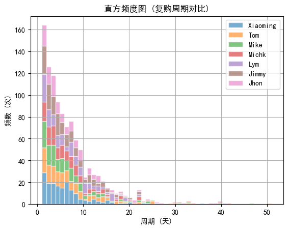
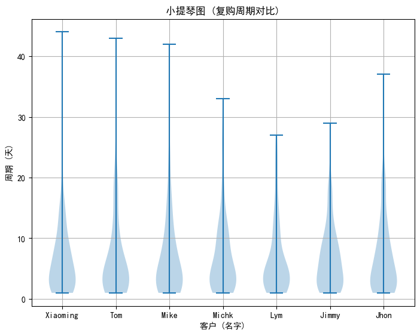

# 文章_数据分析_用户维度复购周期可视化分析(Pandas和Matplotlib)_GF_2023-07-24

分析维度包括:

1. 复购次数

2. 复购周期

3. 复购周期对比

## 构建测试数据

这里你可以了解到:

* 如何生成时间相关的数据。

* 如何从列表（可迭代对象）中生成随机数据。

* Pandas 的 DataFrame 自行创建, 包含生成新字段。

* Pandas 数据合并。

**(1) 构建数据: 时间字段**:

```python
time_range = pd.date_range(start="2019/01/01", end="2021/12/31")

print("[Message] Time Range Built Through Pandas:")
print(time_range)

print("[Message] Time Length Built Through Pandas:")
print(len(time_range))
```

输出:

```txt
[Message] Time Range Built Through Pandas:
DatetimeIndex(['2019-01-01', '2019-01-02', '2019-01-03', '2019-01-04',
               '2019-01-05', '2019-01-06', '2019-01-07', '2019-01-08',
               '2019-01-09', '2019-01-10',
               ...
               '2021-12-22', '2021-12-23', '2021-12-24', '2021-12-25',
               '2021-12-26', '2021-12-27', '2021-12-28', '2021-12-29',
               '2021-12-30', '2021-12-31'],
              dtype='datetime64[ns]', length=1096, freq='D')
[Message] Time Length Built Through Pandas:
1096
```

**(2) 构建数据: 水果列表**:

```python
fruits = ["香蕉", "苹果", "葡萄", "橙子", "哈密瓜", "芭乐", "梨", "桃子"]
fruits_list = np.random.choice(fruits, size=len(time_range), replace=True)

print("[Message] Fruits List Built Through NumPy:")
print(fruits_list)

print("[Message] Length of Fruits List Built Through NumPy:")
print(len(fruits_list))
```

输出:

```txt
[Message] Fruits List Built Through NumPy:
['香蕉' '葡萄' '香蕉' ... '香蕉' '橙子' '桃子']
[Message] Length of Fruits List Built Through NumPy:
1096
```

**(3) 构建数据: 客户列表**:

```python
names = ["Mike", "Jhon", "Tom", "Xiaoming", "Jimmy", "Lym", "Michk"]
names_list = np.random.choice(names, size=len(time_range), replace=True)

print("[Message] Customer List Built Through NumPy:")
print(names_list)

print("[Message] Length of Customer List Built Through NumPy:")
print(len(names_list))
```

输出:

```txt
[Message] Customer List Built Through NumPy:
['Mike' 'Michk' 'Michk' ... 'Xiaoming' 'Jhon' 'Lym']
[Message] Length of Customer List Built Through NumPy:
1096
```

**(4) 构建数据: 订单数据**:

```python
order = pd.DataFrame({"time": time_range,   # -> 下单时间。
                      "fruit": fruits_list, # -> 水果名称。
                      "name": names_list,   # -> 顾客名。
                      "kilogram": np.random.choice(list(range(50,100)), size=len(time_range),replace=True)}) # -> 购买量。

print("[Message] Generate Order Data Through Pandas DataFrame:")
print(order)
```

输出:

```txt
[Message] Generate Order Data Through Pandas DataFrame:
            time  fruit      name  kilogram
0     2019-01-01   香蕉      Mike        63
1     2019-01-02   葡萄     Michk        69
2     2019-01-03   香蕉     Michk        51
3     2019-01-04   香蕉      Mike        69
4     2019-01-05   香蕉       Tom        64
...          ...    ...       ...       ...
1091  2021-12-27   葡萄       Lym        94
1092  2021-12-28     梨  Xiaoming        60
1093  2021-12-29   香蕉  Xiaoming        95
1094  2021-12-30   橙子      Jhon        90
1095  2021-12-31   桃子       Lym        93

[1096 rows x 4 columns]
```

**(5) 构建数据: 水果信息**:

```python
information = pd.DataFrame({"fruit": fruits,
                            "price": [3.8, 8.9, 12.8, 6.8, 15.8, 4.9, 5.8, 7],
                            "region": ["华南", "华北", "西北", "华中", "西北", "华南", "华北", "华中"]})

print("[Message] Building Fruits Information Through Pandas DataFrame:")
print(information)
```

输出:

```txt
[Message] Building Fruits Information Through Pandas DataFrame:
    fruit  price  region
0    香蕉    3.8    华南
1    苹果    8.9    华北
2    葡萄   12.8    西北
3    橙子    6.8    华中
4  哈密瓜   15.8    西北
5    芭乐    4.9    华南
6      梨    5.8    华北
7    桃子    7.0    华中
```

**(6) 构建数据: 合并订单数据和水果信息**:

```python
# 将订单信息和水果信息直接合并成一个完整的 DataFrame, 这个 df 就是要用到的测试数据。
df = pd.merge(order, information, how="outer").sort_values("time").reset_index(drop=True)

print("[Message] Merge Order Data and Fruits Information Through Pandas DataFrame:")
print(df)
```

输出:

```txt
[Message] Merge Order Data and Fruits Information Through Pandas DataFrame:
            time  fruit      name  kilogram  price  region
0     2019-01-01   香蕉      Mike        63    3.8    华南
1     2019-01-02   葡萄     Michk        69   12.8    西北
2     2019-01-03   香蕉     Michk        51    3.8    华南
3     2019-01-04   香蕉      Mike        69    3.8    华南
4     2019-01-05   香蕉       Tom        64    3.8    华南
...          ...    ...       ...       ...    ...   ...
1091  2021-12-27   葡萄       Lym        94   12.8    西北
1092  2021-12-28     梨  Xiaoming        60    5.8    华北
1093  2021-12-29   香蕉  Xiaoming        95    3.8    华南
1094  2021-12-30   橙子      Jhon        90    6.8    华中
1095  2021-12-31   桃子       Lym        93    7.0    华中

[1096 rows x 6 columns]
```

**(7) 构建数据: 计算订单金额**:

```python
df["amount"] = df["kilogram"] * df["price"]

print("[Message] Compute Order Amount Through Pandas DataFrame:")
print(df.head())
```

输出:

```txt
[Message] Compute Order Amount Through Pandas DataFrame:
         time  fruit   name  kilogram  price  region  amount
0  2019-01-01   香蕉   Mike        63    3.8    华南   239.4
1  2019-01-02   葡萄  Michk        69   12.8    西北   883.2
2  2019-01-03   香蕉  Michk        51    3.8    华南   193.8
3  2019-01-04   香蕉   Mike        69    3.8    华南   262.2
4  2019-01-05   香蕉    Tom        64    3.8    华南   243.2
```

## 配置 Matplotlib (全局配置)

```python
# 指定 Matplotlib 默认字体 (解决中文无法显示的问题)。
plt.rcParams['font.sans-serif'] = ['SimHei']

# 解决 Matplotlib 保存图像时负号 "-" 显示方块的问题。
plt.rcParams['axes.unicode_minus'] = False

# 设置 Matplotlib 字体大小 (全局生效)。
plt.rcParams['font.size'] = 10
```

## 计算用户复购周期

复购周期是用户每两次购买之间的时间间隔, 以 xiaoming 用户为例, 前 2 次的复购周期分别是 2 天和 5 天。

**分步骤计算用户复购周期**:

```python
# 计算用户复购周期(1): 按每个用户分组对购买时间升序排列。
sorted = df[["name", "time"]].sort_values(["name", "time"], ascending=[False, True])

# 计算用户复购周期(2): 将时间向下移动一个单位。
shifted = sorted.groupby("name").shift(1)._rename(columns={"time": "shift_time"})

print("[Message] Data Preview After Time Shift:")
print(shifted, '\n')

# 计算用户复购周期(3): 合并 "按每个用户分组对购买时间升序排列" 和 "时间向下移动一个单位"。
Concatenated = pd.concat([sorted, shifted], axis=1)

print("[Message] Data Preview After Concatenate:")
print(Concatenated, '\n')

# 出现空值(NaT)是因为每个用户的第一条记录之前是没有数据, 这里直接删除空值部分。
Concatenated.dropna(inplace=True)

# 计算用户复购周期(4): 计算两次购买时间之间的差值 (复购周期)。
Concatenated["time_delta"] = Concatenated["time"] - Concatenated["shift_time"]

# 直接将时间格式取出天数的数值部分。
Concatenated["repurchase_cycle"] = Concatenated["time_delta"].apply(lambda x: x.days)

print("[Message] User Repurchase Cycle Pandas DataFrame:")
print(Concatenated, '\n')
```

输出:

```txt
[Message] Data Preview After Time Shift:
      shift_time
0            NaT
2     2019-01-01
7     2019-01-03
8     2019-01-08
12    2019-01-09
...          ...
1059  2021-11-14
1063  2021-11-25
1079  2021-11-29
1080  2021-12-15
1083  2021-12-16

[1096 rows x 1 columns] 

[Message] Data Preview After Concatenate:
          name        time  shift_time
0     Xiaoming  2019-01-01         NaT
2     Xiaoming  2019-01-03  2019-01-01
7     Xiaoming  2019-01-08  2019-01-03
8     Xiaoming  2019-01-09  2019-01-08
12    Xiaoming  2019-01-13  2019-01-09
...        ...         ...         ...
1059      Jhon  2021-11-25  2021-11-14
1063      Jhon  2021-11-29  2021-11-25
1079      Jhon  2021-12-15  2021-11-29
1080      Jhon  2021-12-16  2021-12-15
1083      Jhon  2021-12-19  2021-12-16

[1096 rows x 3 columns] 

[Message] User Repurchase Cycle Pandas DataFrame:
          name        time  shift_time  time_delta  repurchase_cycle
2     Xiaoming  2019-01-03  2019-01-01      2 days                 2
7     Xiaoming  2019-01-08  2019-01-03      5 days                 5
8     Xiaoming  2019-01-09  2019-01-08      1 days                 1
12    Xiaoming  2019-01-13  2019-01-09      4 days                 4
16    Xiaoming  2019-01-17  2019-01-13      4 days                 4
...        ...         ...         ...         ...               ...
1059      Jhon  2021-11-25  2021-11-14     11 days                11
1063      Jhon  2021-11-29  2021-11-25      4 days                 4
1079      Jhon  2021-12-15  2021-11-29     16 days                16
1080      Jhon  2021-12-16  2021-12-15      1 days                 1
1083      Jhon  2021-12-19  2021-12-16      3 days                 3

[1089 rows x 5 columns] 
```

**计算每个用户整体复购次数和平均复购周期**:

得到一个结论: 有的用户整体的复购周期是比较长的, 长期来看是忠诚的用户。

而且从平均复购周期来看, 相对较低, 说明在短时间内复购活跃。

```python
# 计算每个用户整体复购次数和平均复购周期。
result = Concatenated.groupby("name")["repurchase_cycle"].agg(["count", "mean"])

print("[Message] User's Overall Repurchase Count and Repurchase Cycle Pandas DataFrame:")
print(result, '\n')
```

输出:

```txt
[Message] User's Overall Repurchase Count and Repurchase Cycle Pandas DataFrame:
          count      mean
name                     
Jhon        143  7.510490
Jimmy       171  6.321637
Lym         148  7.331081
Michk       145  7.462069
Mike        152  7.065789
Tom         152  7.184211
Xiaoming    178  6.073034 
```

## 使用 Matplotlib 对数据进行可视化

**绘制复购周期对比的直方频度图**:

matplotlib.pyplot 的 .hist 函数用于绘制直方图。直方图是一种用来表示数据分布的图形, 它将数据分成若干个区间, 然后统计每个区间中数据的数量, 最终以柱状图的形式展示出来。

```txt
基本用法:
data = [1, 2, 2, 3, 3, 3, 4, 4, 4, 4, 5, 5, 5, 5, 5]
matplotlib.pyplot.hist(data, bins=5)  # -> bins 参数表示要将数据分成多少个区间。

常用参数:
* bins: 用于指定数据分成的区间数量, 可以是一个整数, 也可以是一个区间列表。如果不指定该参数, matplotlib 会自动选择合适的区间数量。
* range: 用于指定数据的取值范围, 以元组的形式传递, 例如 (0, 10) 表示只考虑数据在 0 到 10 之间的部分。
* density: 如果设置为 True, 则直方图的面积将归一化为 1, 这样可以将直方图视为概率密度函数。
* color: 用于设置直方图的颜色。
* alpha: 用于设置直方图的透明度。
* edgecolor: 用于设置直方图柱子的边缘颜色。
* cumulative: 如果设置为 True, 则绘制累积直方图, 显示每个区间内数据点的累积数量。
```

本例代码:

```python
# 需要注意的是, 直方图和我们常见的柱状图可不一样。
# 直方图用于显示定量数据的分布；而柱状图对比定类数据。
# 在绘制时, 直方图是按照数值大小进行分组排列, 前后顺序不可变更。
# 柱状图则是对分类对象进行分组, 而不是根据具体数值进行分组, 分组顺序可以调整。

LIST_for_Max = Concatenated["repurchase_cycle"].max()
LIST_for_User = Concatenated["name"].drop_duplicates()
LIST_for_Histo = []

for u in LIST_for_User:
    LIST_for_Histo.append(Concatenated[Concatenated.name == u]["repurchase_cycle"])

plt.hist(x=LIST_for_Histo,    # -> 绘图数据。
         bins=LIST_for_Max,   # -> 指定直方图的条形数为20个。
         edgecolor='w',       # -> 指定直方图的边框色。
         #color=['c', 'r'],   # -> 指定直方图的填充色。
         label=LIST_for_User, # -> 为直方图呈现图例。
         density=False,       # -> 是否将纵轴设置为密度 (即频率)。
         alpha=0.6,           # -> 透明度。
         rwidth=1,            # -> 直方图宽度百分比 (0 - 1)。
         stacked=True)        # -> 当有多个数据时, 是否需要将直方图呈堆叠摆放 (默认水平摆放)。

plt.title("直方频度图 (复购周期对比)")
plt.xlabel("周期 (天)")
plt.ylabel("频数 (次)")
plt.legend() # -> 显示图例。
plt.grid(True)
    
plt.show()
```

预览:



**绘制复购周期对比的小提琴图(Violin Plot)**:

小提琴图(Violin Plot) 是一种可视化数据分布和密度的图表类型。它显示了数据的整体分布形状以及估计的核密度曲线。

```txt
基本使用:
data = [4, 7, 8, 9, 12, 15, 18, 21, 24, 28] # -> 数据。
matplotlib.pyplot.violinplot(data)          # -> 绘制小提琴图。
 
常用参数:
* vert: 设置小提琴的方向, 如果设置为 True(默认), 则为垂直方向；如果设置为 False, 则为水平方向。
* showmedians: 设置是否显示中位数的线。
* showextrema: 设置是否显示最值的线。
* showmeans: 设置是否显示均值的线。
* bw_method: 用于计算核密度估计的带宽, 可选值包括 'scott', 'silverman', float 等。
```

本例代码:

```python
# 小提琴图 (Violin Plot) 是用来展示多组数据的分布状态以及概率密度。
# 这种图表结合了箱形图和密度图的特征, 主要用来显示数据的分布形状。
# 跟箱形图类似, 但是在密度层面展示更好。在数据量非常大不方便一个一个展示的时候小提琴图特别适用。

LIST_for_User = Concatenated["name"].drop_duplicates()
LIST_for_Violin = []

for u in LIST_for_User:
    LIST_for_Violin.append(Concatenated[Concatenated.name == u]["repurchase_cycle"])

# 配置 Matplotlib 创建画布和坐标轴。
fig = plt.figure()
ax = fig.add_axes([0,0,1,1])

# 使用 Matplotlib 绘制 小提琴图(Violin Plot)。
ax.violinplot(LIST_for_Violin)

# 配置 Matplotlib 固定刻度位置以及设置刻度标签。
ax.set_xticks([1, 2, 3, 4, 5, 6, 7]) # -> 使用 axis.set_xticks 固定刻度位置 (新添加内容)。
ax.set_xticklabels(LIST_for_User)    # -> 将客户名字作为 X 轴标签。

plt.title("小提琴图 (复购周期对比)")
plt.xlabel("客户 (名字)")
plt.ylabel("周期 (天)")
plt.grid(True)

plt.show()
```

预览:



## 完整代码

```python
#!/usr/bin/python3
# Create By GF 2023-07-24

# 分析维度包括:
# 1. 复购次数
# 2. 复购周期
# 3. 复购周期对比

import numpy as np
import pandas as pd
from matplotlib import pyplot as plt
from matplotlib.cm import ScalarMappable

# (1) 构建数据: 时间字段。
time_range = pd.date_range(start="2019/01/01", end="2021/12/31")

print("[Message] Time Range Built Through Pandas:")
print(time_range)

print("[Message] Time Length Built Through Pandas:")
print(len(time_range))

# (2) 构建数据: 水果列表。
fruits = ["香蕉", "苹果", "葡萄", "橙子", "哈密瓜", "芭乐", "梨", "桃子"]
fruits_list = np.random.choice(fruits, size=len(time_range), replace=True)

print("[Message] Fruits List Built Through NumPy:")
print(fruits_list)

print("[Message] Length of Fruits List Built Through NumPy:")
print(len(fruits_list))

# (2) 构建数据: 客户列表。
names = ["Mike", "Jhon", "Tom", "Xiaoming", "Jimmy", "Lym", "Michk"]
names_list = np.random.choice(names, size=len(time_range), replace=True)

print("[Message] Customer List Built Through NumPy:")
print(names_list)

print("[Message] Length of Customer List Built Through NumPy:")
print(len(names_list))

# (4) 构建数据: 订单数据。
order = pd.DataFrame({"time": time_range,   # -> 下单时间。
                      "fruit": fruits_list, # -> 水果名称。
                      "name": names_list,   # -> 顾客名。
                      "kilogram": np.random.choice(list(range(50,100)), size=len(time_range),replace=True)}) # -> 购买量。

print("[Message] Generate Order Data Through Pandas DataFrame:")
print(order)

# (5) 构建数据: 水果信息。
information = pd.DataFrame({"fruit": fruits,
                            "price": [3.8, 8.9, 12.8, 6.8, 15.8, 4.9, 5.8, 7],
                            "region": ["华南", "华北", "西北", "华中", "西北", "华南", "华北", "华中"]})

print("[Message] Building Fruits Information Through Pandas DataFrame:")
print(information)

# (6) 构建数据: 合并订单数据和水果信息。
# 将订单信息和水果信息直接合并成一个完整的 DataFrame, 这个 df 就是要用到的测试数据。
df = pd.merge(order, information, how="outer").sort_values("time").reset_index(drop=True)

print("[Message] Merge Order Data and Fruits Information Through Pandas DataFrame:")
print(df)

# (7) 构建数据: 计算订单金额。
df["amount"] = df["kilogram"] * df["price"]

print("[Message] Compute Order Amount Through Pandas DataFrame:")
print(df.head())

# ####################################################################################################

# 指定 Matplotlib 默认字体 (解决中文无法显示的问题)。
plt.rcParams['font.sans-serif'] = ['SimHei']

# 解决 Matplotlib 保存图像时负号 "-" 显示方块的问题。
plt.rcParams['axes.unicode_minus'] = False

# 设置 Matplotlib 字体大小 (全局生效)。
plt.rcParams['font.size'] = 10

# ####################################################################################################
# 分步骤计算用户复购周期

# 计算用户复购周期(1): 按每个用户分组对购买时间升序排列。
sorted = df[["name", "time"]].sort_values(["name", "time"], ascending=[False, True])

# 计算用户复购周期(2): 将时间向下移动一个单位。
shifted = sorted.groupby("name").shift(1)._rename(columns={"time": "shift_time"})

print("[Message] Data Preview After Time Shift:")
print(shifted, '\n')

# 计算用户复购周期(3): 合并 "按每个用户分组对购买时间升序排列" 和 "时间向下移动一个单位"。
Concatenated = pd.concat([sorted, shifted], axis=1)

print("[Message] Data Preview After Concatenate:")
print(Concatenated, '\n')

# 出现空值(NaT)是因为每个用户的第一条记录之前是没有数据, 这里直接删除空值部分。
Concatenated.dropna(inplace=True)

# 计算用户复购周期(4): 计算两次购买时间之间的差值 (复购周期)。
Concatenated["time_delta"] = Concatenated["time"] - Concatenated["shift_time"]

# 直接将时间格式取出天数的数值部分。
Concatenated["repurchase_cycle"] = Concatenated["time_delta"].apply(lambda x: x.days)

print("[Message] User Repurchase Cycle Pandas DataFrame:")
print(Concatenated, '\n')

# ####################################################################################################

# 计算每个用户整体复购次数和平均复购周期。
result = Concatenated.groupby("name")["repurchase_cycle"].agg(["count", "mean"])

print("[Message] User's Overall Repurchase Count and Repurchase Cycle Pandas DataFrame:")
print(result, '\n')

# ####################################################################################################
# 绘制复购周期对比的直方频度图

# 需要注意的是, 直方图和我们常见的柱状图可不一样。
# 直方图用于显示定量数据的分布；而柱状图对比定类数据。
# 在绘制时, 直方图是按照数值大小进行分组排列, 前后顺序不可变更。
# 柱状图则是对分类对象进行分组, 而不是根据具体数值进行分组, 分组顺序可以调整。

LIST_for_Max = Concatenated["repurchase_cycle"].max()
LIST_for_User = Concatenated["name"].drop_duplicates()
LIST_for_Histo = []

for u in LIST_for_User:
    LIST_for_Histo.append(Concatenated[Concatenated.name == u]["repurchase_cycle"])

plt.hist(x=LIST_for_Histo,    # -> 绘图数据。
         bins=LIST_for_Max,   # -> 指定直方图的条形数为20个。
         edgecolor='w',       # -> 指定直方图的边框色。
         #color=['c', 'r'],   # -> 指定直方图的填充色。
         label=LIST_for_User, # -> 为直方图呈现图例。
         density=False,       # -> 是否将纵轴设置为密度 (即频率)。
         alpha=0.6,           # -> 透明度。
         rwidth=1,            # -> 直方图宽度百分比 (0 - 1)。
         stacked=True)        # -> 当有多个数据时, 是否需要将直方图呈堆叠摆放 (默认水平摆放)。

plt.title("直方频度图 (复购周期对比)")
plt.xlabel("周期 (天)")
plt.ylabel("频数 (次)")
plt.legend() # -> 显示图例。
plt.grid(True)
    
plt.show()

# ####################################################################################################
# 绘制复购周期对比的小提琴图(Violin Plot)

# 小提琴图 (Violin Plot) 是用来展示多组数据的分布状态以及概率密度。
# 这种图表结合了箱形图和密度图的特征, 主要用来显示数据的分布形状。
# 跟箱形图类似, 但是在密度层面展示更好。在数据量非常大不方便一个一个展示的时候小提琴图特别适用。

LIST_for_User = Concatenated["name"].drop_duplicates()
LIST_for_Violin = []

for u in LIST_for_User:
    LIST_for_Violin.append(Concatenated[Concatenated.name == u]["repurchase_cycle"])

# 配置 Matplotlib 创建画布和坐标轴。
fig = plt.figure()
ax = fig.add_axes([0,0,1,1])

# 使用 Matplotlib 绘制 小提琴图(Violin Plot)。
ax.violinplot(LIST_for_Violin)

# 配置 Matplotlib 固定刻度位置以及设置刻度标签。
ax.set_xticks([1, 2, 3, 4, 5, 6, 7]) # -> 使用 axis.set_xticks 固定刻度位置 (新添加内容)。
ax.set_xticklabels(LIST_for_User)    # -> 将客户名字作为 X 轴标签。

plt.title("小提琴图 (复购周期对比)")
plt.xlabel("客户 (名字)")
plt.ylabel("周期 (天)")
plt.grid(True)

plt.show()

```

## 总结

以上就是关于 数据分析 用户维度复购周期可视化分析(Pandas和Matplotlib) 的全部内容。

更多内容可以访问我的代码仓库:

https://gitee.com/goufeng928/public

https://github.com/goufeng928/public
