# 文章_缠论_笔-线段-中枢概念_及顶底分型位置对笔的判断_GF_2019-02-19.md

很多朋友虽然学习缠论也有了一段时间, 但是实际上错误百出导致不能准确找到一笔。

缠论中的老笔、新笔的画法, 很多人都会画, 但是让一些朋友感到茫然的是: 在 K 线图中明明够一笔, 为什么缠论技术派却说不能画成一笔。

其实, 这笔的判定可能是受了顶底分型的位置的影响。

--------------------------------------------------

## (一) 顶底分型位置对笔的判断

关于顶底分型位置因素对笔的判定, 根据缠论, 有两个显然的条件:

### 1. 顶分型最高 K 线区间至少要有一部分高于底分型最低 K 线区间

缠中说禅说:

"当然, 还有一个最显然的, 就是在同一笔中, 顶分型中最高那 K 线的区间至少要有一部分高于底分型中最低那 K 线的区间, 如果这条都不满足, 也就是顶都在低的范围内或顶比底还低, 这显然是不可接受的。"

如下图:

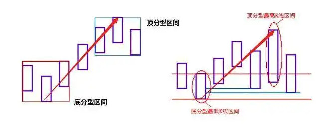

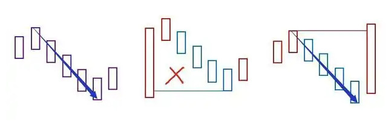

### 2. 上行笔顶分型区间要高于底分型区间, 下行笔底分型区间要低于顶分型区间

对于下行笔, 缠中说禅在《震荡前行、多空齐杀》 (2007-09-24 15:26:30) 一文中有说明, 文末并附 1 分钟上证指数图:

"请注意, 下面第一个绿箭头处不是笔, 为什么? 因为顶分型都在底分型下面了, 怎么可能? 而第二箭头处就是标准是按最新标准的笔了。"

第一个绿箭头处的 K 线, 根据网友用飞狐软件还原数据, 画成下图:

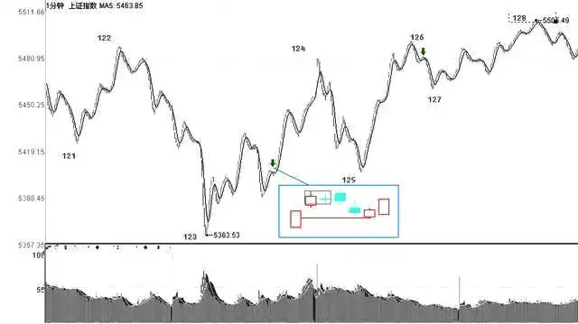

可以看到第一个绿箭头处的 K 线, 按新笔标准够一笔, 但是底分型区间并不低于顶分型区间, 故缠中说禅不认可这一笔。

对于上行的笔, 没发现缠中说禅相关文字, 其实既知道下行笔的要求, 上行笔是反之亦然的道理: 上行笔顶分型区间要高于底分型区间。

如下面的上证指数自定义月线图, 顶分型区间并不高于底分型区间, AB 间的 K 线不认为是一笔。

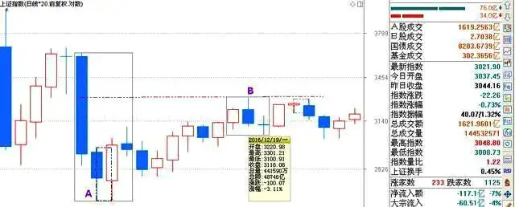

有满足笔成立的 K 线数量, 符合前两条要求, 完全可以判断缠中说禅的笔是否成立了, 即使后来出现这种形势:

"上行笔之后顶分型区间向下包含了底分型区间, 下行笔之后底分型区间向上包含了顶分型区间"

这种笔都不会被取消而是成立的。

对于上行笔前述这种情况, 缠中说禅完全认可是一笔, 如他在博文中说: "6124 点下来只出现过一次周的笔反弹, 因此, 最大期望就是这次能制造第二个。"

上证指数周线图如下:

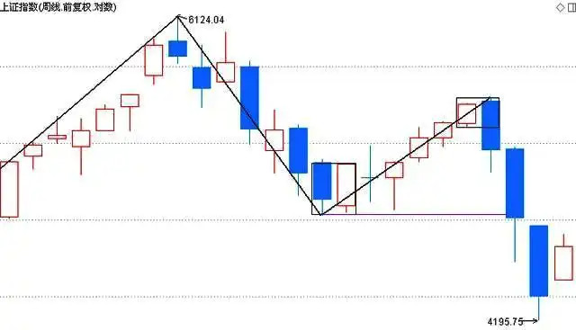

可以看看会不会继续走周线上升一笔!

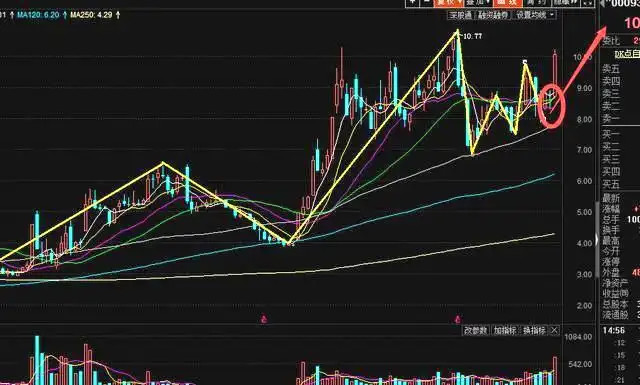

缠中说禅表面上非常复杂, 其实不然, 缠中说禅炒股理论的核心思想是中枢与背弛, 背弛与传统技术分析的背离有相同之处, 但并不是同一定义。

中枢可以理解为横盘, 而背弛则可以理解为转折的出现, 作者通过对走势图的精确划分来定义了三个买点及三个卖点。

这个章节整理的文章有的是我自己的理解, 希望对大家有所帮助!

--------------------------------------------------

## (二) 笔-线段-中枢概念

### 1. 先从基本概念及图形的分解开始

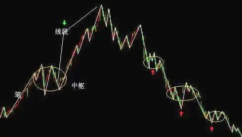

椭圆为中枢, 每一条直线为笔, 线段至少由三笔构成。

### 2. 基本图形的分解:

缠中说禅理论最核心的东西就是图形的分解: 最小的单位是 K 线,  K 线组成笔, 笔组成线段, 线段的连绵就组成了走势, 走势分为盘整与趋势, 趋势又分为上涨与下跌。

"K 线 -> 分型 -> 笔 -> 线段 -> 走势"

走势分为: 上涨、下跌、中枢。

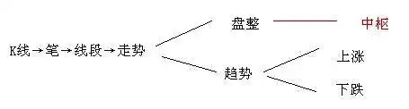

#### 2.1. K 线: 阴线, 阳线

K 线又被称为蜡烛线, 也叫阴阳烛,  K 线是一条柱状的线条, 由影线和实体组成。影线在实体上方的部分叫上影线, 下方的部分叫下影线。

实体分阳线和阴线两种, 又称 红(阳) 线和 黑(阴) 线。一条 K 线的记录就是某一种股票一天的价格变动情况。

K 线将买卖双方力量的增减与转变过程及实战结果用图形表示出来。经过近百年来的使用与改进,  K 线理论被投资人广泛接受。

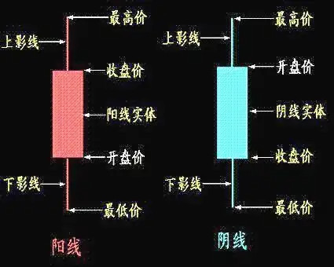

当收盘价高于开盘价时, 实体部分一般绘成红色或空白, 称为 "阳线"。

当收盘价低于开盘价时, 实体部分一般绘成绿色或黑色, 称为 "阴线"。

#### 2.2. 笔

笔是构成线段的基础, 两个相邻的顶和底之间构成一笔。那先来了解顶和底。

顶分型: 第二根 K 线的上点是3根 K 线中上点的最高点, 同时第二根 K 线的下点也是3根 K 线中下点的最高点。本质是上升后转折成下降。

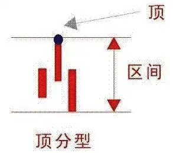

底分型: 第二根 K 线的上点是3根 K 线中上点的最低点, 同时第二根 K 线的下点也使3根 K 线中下点的最低点。本质是下降后转折成上升。

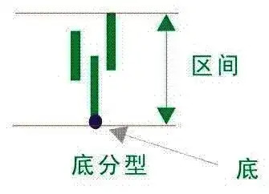

顶分型的顶就叫做顶, 底分型的底就叫做底, 根据定义, 两个相邻的顶和底之间构成一笔。在实际分析中, 都必须要求顶和底之间都至少有一 K 线当成一笔的最基本要求。

包含关系的中线:

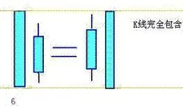

笔的结合律:

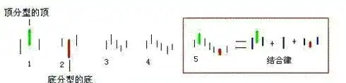

两个相邻的顶和底之间构成一笔, 所谓笔, 就是顶和底之间的其他波动, 都可以忽略不算, 但注意, 一定是相邻的顶和底, 隔了几个就不是了。

而所谓的线段, 就是至少由三笔组成。但这里有一个细微的地方要分清楚, 因为结合律是必须遵守的, 像 图3 这种, 顶和底之间必须共用一个 K 线, 这就违反结合律了, 所以这不算一笔。

而 图4, 就光是顶和底了, 中间没有其他 K 线, 一般来说, 也最好不算一笔。

而 图5, 是一笔的最基本的图形, 顶和底之间还有一根 K 线。

在实际分析中, 都必须要求顶和底之间都至少有一 K 线当成一笔的最基本要求。

上升的一笔, 根据结合律: 底分型 + 上升 K 线 + 顶分型。

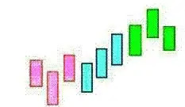

同理, 下降的一笔:

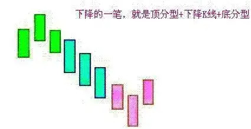

#### 2.3. 线段

线段至少由三笔组成。线段的前三笔, 必须有重叠的部分。

**线段的最基本形态**:

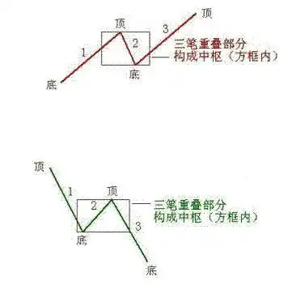

**线段破坏的基本形式**:

也就是两线段组合的其中一种形态 (注: 这里的形态是不充分的, 详见后文):

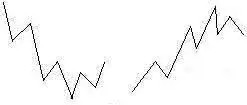

**线段被笔破坏**:

线段无非有两种, 从向上一笔开始的, 和从向下一笔开始的。

对于从向上一笔开始的, 其中的分型构成这样的序列: d1g1, d2g2, d3g3, ..., dngn (其中 di 代表第 i 个底, gi 代表第 i 个顶)。

如果找到 i 和 j, j >= i + 2, 使得 dj <= gi, 那么称向上线段被笔破坏。

对于从向下一笔开始的, 其中的分型构成这样的序列: g1d1, g2d2, g3d3, ..., gndn (其中 di 代表第 i 个底, gi 代表第 i 个顶)。

如果找到 i 和 j, j >= i + 2, 使得 gj >= di, 那么称向下线段被笔破坏。

线段要被笔破坏, 那么必须其最后一个特征序列的缺口被封闭, 否则就不存在被笔破坏的情况。

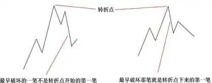

**缠中说禅线段分解定理**:

线段被破坏, 当且仅当至少被有重叠部分的连续三笔的其中一笔破坏。而只要构成有重叠部分的前三笔, 那么必然会形成一线段, 换言之, 线段破坏的充要条件, 就是被另一个线段破坏。

**线段划分的标准**:

本课, 就是把前面 "线段破坏的充要条件就是被另一个线段破坏" 精确化了。因此, 以后关于线段的划分, 都以此精确的定义为基础。

第一种情况: 特征序列的顶分型中, 第一和第二元素间不存在特征序列的缺口, 那么该线段在该顶分型的高点处结束, 该高点是该线段的终点; 特征序列的底分型中, 第一和第二元素间不存在特征序列的缺口, 那么该线段在该底分型的低点处结束, 该低点是该线段的终点; (没有缺口: 找顶分型)

第二种情况: 特征序列的顶分型中, 第一和第二元素间存在特征序列的缺口, 如果从该分型最高点开始的向下一笔开始的序列的特征序列出现底分型, 那么该线段在该顶分型的高点处结束, 该高点是该线段的终点; 

特征序列的底分型中, 第一和第二元素间存在特征序列的缺口, 如果从该分型最低点开始的向上一笔开始的序列的特征序列出现顶分型, 那么该线段在该底分型的低点处结束, 该低点是该线段的终点; (有缺口, 找顶分型下来的底分型)

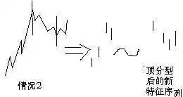

**线段划分的程序**:

假设某转折点是两线段的分界点, 然后对此用线段划分的两种情况去考察是否满足, 如果满足其中一种, 那么这点就是真正的线段的分界点; 如果不满足, 那就不是, 原来的线段依然延续, 就这么简单。

第一种情况从转折点开始, 如果第一笔就破坏了前线段, 进而该笔延伸出三笔来, 其中第三笔破点第一笔的结束位置, 那么, 新的线段一定形成, 前线段一定结束。复杂一点的情况, 就是第三笔完全在第一笔的范围内, 无非两种最后的结果:

(1) 最终还是先破了第一笔的结束位置, 这时候, 新的线段显然成立, 旧线段还是被破坏了; 

(2) 最终, 先破第一笔的开始位置, 这样, 旧线段只被一笔破坏, 接着就延续原来的方向, 那么, 显然旧线段依然延续, 新线段没有出现。

**包含关系**:

(1) 假设的转折点前后那两元素, 是不存在包含关系的, 因为, 这两者已经被假设不是同一性质的东西, 不一定是同一特征序列的。

(2) 假设的转折点后的顶分型的元素, 是可以应用包含关系的。为什么? 因为, 这些元素间, 肯定是同一性质的东西, 或者就是原线段的延续, 那么就同是原线段的特征序列中, 或者就是新线段的非特征序列中, 反正都是同一类的东西。

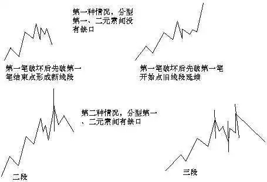

**古怪的线段**:

一般来说, 在类似单边的走势中, 线段都很简单, 不会有太复杂的情况, 而在震荡中, 线段出现所谓古怪的可能性就大增了。

所有古怪的线段, 都是因为线段出现第一种情况的笔破坏后最终没有在该方向由该笔发展形成线段破坏所造成的, 这是线段古怪的唯一原因。

因为, 如果线段能在该方向出现被线段破坏, 那就很正常了, 没什么古怪的。

这里有一个细节必须注意, 线段最终肯定都会被线段破坏, 但线段出现笔破坏后最终并不一定在该方向由该笔发展形成线段破坏。

### 3. 注意

(1) 使用级别时一定要明白自己做的长线还是短线, 长线最好以周线去选择股票, 要明白大周期走好了小周期才有足够的获利空间。

(2) 顶底分型在使用的时候要注意看第 3 根 K 线处于一个什么位置? 是阴线还是阳线在去确定一笔是否结束。

(3) 中枢使用的时候要知道是本级别还是次级别, 这个很重要!

--------------------------------------------------

实话, 缠论是非常厉害的技术, 但缠论是不适合大多数人学的。

有时候, 不得不承认, 人和人之间是有差距的, 悟性, 知识面, 勤奋度, 思维方式, 甚至性格, 都是学成与否的因素。

缠论也不是勤能补拙就能学会的东西, 所以缠师才有得其道者三五人的感叹。而大多数人注定与缠无缘。

否则缠论出来几年了, 到现在没见过一个在实战操作上打得响的学长, 持续亏损的持续亏损, 收山的收山 (喜欢 yy 其人是悟道了实现财务自由了才收山的随便幻想), 前几日看到过一个知名缠徒王纯阳的帖子, 说是曾经从30万亏到了只剩3万。

其实, 就缠论技术而言, 前 20 课的东西更适合大众, 真能把均线, MACD 这些吃透了, 不敢说从此财务自由, 但是账户资金每年稳定增长是没有问题的。

有人说, 均线这么简单的东西谁看不懂? 真看懂了吗? 我学缠1年半, 其他理论技术书籍啃了不下百本, 直到最近, 才体会到均线的重要之处, 你能通过均线感受到走势的一鼓作气再而衰三而竭的过程吗? 感受到阴阳多空力量的转换吗?

并且能根据这种体会去顺势操作, 加上一定的仓位管理 (资金配备的重要程度超过选股), 那么赚钱根本不是问题。

--------------------------------------------------

## (三) 总结

多大的头戴多大帽子, 多深的内力练几层乾坤大挪移。

人, 最重要是能够明白自己的能力, 20 课以后的技术, 对极少数人来说, 是屠龙刀, 这些人是食物链顶端;

对少数人来说, 是七伤拳, 有时候逃顶抄底挺准, 但少数时候的失误, 就使得元气大伤, 几次赚的还不够一次亏的;

而对大部分人来说, 是自宫的刀, 一直割啊割, 直到把根割没了为止。

**我的一些操作感悟**:

**第一**, 我从不买均线空头排列的票, 也就是说, 我不操底。那是神棍做的事情, 咱就不参与了。

当然也不逃顶, 在大级别的操作上, 我只等走势明确转折后才动手。

慢一步, 让走势飞一会儿, 会错过少许利润, 但能获得更大的安全。

**第二**, 缠论的运用, 包括背驰, 区间套这些, 个股操作上, 我只在上升通道的回抽小级别走势里使用 (但绝不在下跌通道里去抓所谓的反弹, 几千只票, 为什么非找走熊的票做?)。

也就是说, 在通道未被破坏的前提下, 寻找上升波段的低点介入, 所以, 像均线空头排列形态的票, 我一看就排除掉了, 大级别都走坏了, 小级别即使有反弹能有多大力度?

很多缠徒亏钱的主要原因是, 学缠以后, 一门心思去找那些下跌走势的票, 然后想抓住所谓的 "背驰点", 来获得心理和金钱上的双重满足, 可问题是, 接下跌中飞刀, 即使让你接准确了几把, 但是没有接到的那几把, 也够让你喝一壶了。

任何理论, 操作上都不可以违背顺势而为的最根本原则。

什么叫顺势而为? 就是跟随趋势, 而不是狂妄地区判断趋势在某一刻转折。那些觉得比市场大多数人都聪明人, 市场必然给他最严厉的教训。

**第三**, 缠论是很好的操作理论, 但是仅仅学缠论是绝对不够的, 那些学缠后 "不读股市糟粕书" 的牛B者, 十有八九亏损累累, 别说那些后学的, 就是那些当年跟随缠师第一批的学长, 有见过一个钢铁了吗?

大多还是在持续亏损中, 这在一些著名缠徒的博客里可以看得出来。

所以别每天钻在 1 分图里出不来, 我告诉你, 我基本不看一分图, 最低 5 分, 因为 A 股是 T + 1。

我也不画笔线段了, 我分解走势使用自定义的多空段, 更贴近实际走势, 更能体现走势力度, 最关键的, 不像原定义的线段要被线段破坏的事后确认, 更贴近当下。

**第四**, 一些控盘程度极高的个股的走势, 用任何理论都不能 100% 完美的解释。

道理很简单, 因为画图的笔在那个掌控者手里。

特别在小级别上, 没有背驰就直接转折, 或者背驰了还继续涨跌的事情比比皆是。

你当下觉得的那个背驰点, 人家为什么不可以继续砸? 我想没有任何神秘力量在保证吧?

**第五**, 也是最重要的一点, 要懂得休息。

每年值得操作的够级别的买点最多不超过 2 次, 大多数年份就一次, 甚至没有。

有机会来了就要抓住, 往死里干, 干完就收工, 绝不拖泥带水恋恋不舍, 这世界可以玩的东西很多。

我从没见过一年到头都在不停操作的人赚大钱, 那种传说中长胜的短线高手, 就只听到过传说。

第十课清楚的说了, 缠师 4 年没看过股票, 以缠师如此技术, 都要休息如此长时间, 只为在真正的机会来临之际, 还能保留有充足的弹药投入战斗。

**总之**, 任何一种理论, 学到了迷信的地步, 注定会形成知识障碍, 只有博采众长, 才能从多角度去理解这个市场。

而市场是简单到了极点但又复杂到了极点的东西。

说它简单, 走势不是涨就是跌二选一; 说它复杂, 其的不可预测性 (混沌,非线性), 非完全复制, 自我生长... 某些极微小的事物就有可能影响最终的走势结果 (蝴蝶效应), "历史不断在重复, 但总不在你认为的地方重复" !

咱不喜欢说那些禅啊悟啊这些虚头八脑的东西, 那是赚不到钱的混子喜欢的口头缠。咱只说最实际的东西, 这些话, 有些你可以理解, 有些你还现在不能理解, 等你理解了, 操作上也能上一个层次了。

--------------------------------------------------

以上就是 缠论 笔-线段-中枢概念 及顶底分型位置对笔的判断 的全部内容。

更多内容可以访问我的代码仓库:

https://gitee.com/goufeng928/finance

https://github.com/goufeng928/finance
